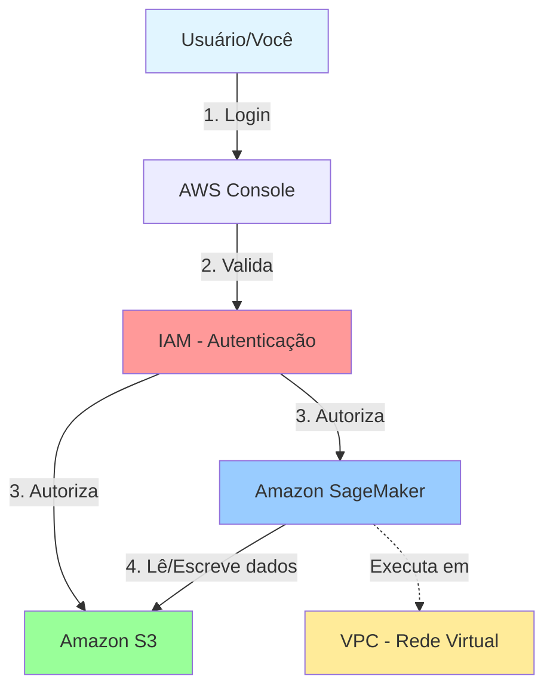

# Módulo 1: Acesso à Conta AWS

## Objetivos de Aprendizagem

Ao final deste módulo, você será capaz de:
- Acessar o console AWS usando credenciais fornecidas
- Navegar entre diferentes regiões AWS
- Verificar permissões necessárias para SageMaker e S3
- Validar o acesso aos serviços necessários

## Duração Estimada
30 minutos

---

## 1. Conceitos Fundamentais

### O que é a AWS?

Amazon Web Services (AWS) é uma plataforma de computação em nuvem que oferece mais de 200 serviços completos de datacenters no mundo todo. Para este treinamento, focaremos em dois serviços principais:

- **Amazon SageMaker**: Serviço gerenciado de Machine Learning
- **Amazon S3**: Serviço de armazenamento de objetos

### O que são Regiões AWS?

Regiões são localizações geográficas onde a AWS mantém datacenters. Cada região é completamente independente e isolada das outras para garantir:
- **Latência reduzida**: Escolher a região mais próxima dos usuários
- **Conformidade**: Algumas regulamentações exigem dados em locais específicos
- **Disponibilidade**: Isolamento de falhas entre regiões

---

## 2. Recebendo Credenciais de Acesso

Durante o treinamento, você receberá um dos seguintes tipos de acesso:

### Opção A: Usuário IAM
```
Nome de usuário: treinamento-usuario-01
Senha: [fornecida pelo instrutor]
URL de login: https://[account-id].signin.aws.amazon.com/console
```

### Opção B: Role de Acesso (Assumir Role)
```
Role ARN: arn:aws:iam::[account-id]:role/SageMakerTrainingRole
Método: AWS SSO ou assume-role via CLI
```

**Importante:** Guarde suas credenciais com segurança e não as compartilhe.

---

## 3. Acessando o Console AWS

### Passo 1: Abrir o Console

1. Abra seu navegador web (Chrome, Firefox ou Safari recomendado)
2. Acesse a URL fornecida pelo instrutor ou: https://console.aws.amazon.com
3. Se solicitado, insira o ID da conta AWS

### Passo 2: Fazer Login

**Para usuário IAM:**
1. Selecione "IAM user" (Usuário IAM)
2. Insira seu nome de usuário
3. Insira sua senha
4. Clique em "Sign in" (Fazer login)

**Para acesso via SSO:**
1. Clique em "Sign in with SSO"
2. Insira a URL do portal fornecida
3. Autentique-se com suas credenciais corporativas

### Passo 3: Configuração Inicial

Após o primeiro login, você pode ser solicitado a:
- Aceitar termos de uso
- Configurar MFA (Multi-Factor Authentication) - opcional para treinamento
- Escolher preferências de idioma

---

## 4. Selecionando a Região Correta

### Por que Frankfurt (eu-central-1)?

Para este treinamento, utilizaremos a região de **Frankfurt (eu-central-1)** por:
- Proximidade geográfica com Portugal
- Conformidade com GDPR
- Disponibilidade completa dos serviços SageMaker

### Como Selecionar a Região

1. No canto superior direito do console, localize o seletor de região
2. Clique no nome da região atual (pode estar como "N. Virginia" ou outra)
3. Na lista suspensa, selecione **"Europe (Frankfurt) eu-central-1"**
4. Aguarde o console atualizar

```
┌─────────────────────────────────────┐
│  AWS Console                        │
│  ┌──────────────────────────────┐  │
│  │ [Nome do Usuário] ▼         │  │
│  │ Europe (Frankfurt) ▼         │  ← Clique aqui
│  └──────────────────────────────┘  │
└─────────────────────────────────────┘
```

**⚠️ IMPORTANTE:** Sempre verifique se está na região correta antes de criar recursos!

---

## 5. Verificando Permissões IAM

### O que é IAM?

IAM (Identity and Access Management) é o serviço que controla quem pode acessar o quê na AWS. Para usar o SageMaker e S3, você precisa de permissões específicas.

### Verificação via Console

**Passo 1: Acessar o IAM**
1. Na barra de pesquisa do console, digite "IAM"
2. Clique em "IAM" nos resultados
3. No menu lateral, clique em "Users" (Usuários)
4. Clique no seu nome de usuário

**Passo 2: Verificar Políticas Anexadas**

Procure pelas seguintes políticas (ou similares):
- ✅ `AmazonSageMakerFullAccess` ou `SageMakerTrainingAccess`
- ✅ `AmazonS3FullAccess` ou `S3DataAccess`

**Exemplo de política necessária:**
```json
{
  "Version": "2012-10-17",
  "Statement": [
    {
      "Effect": "Allow",
      "Action": [
        "sagemaker:*",
        "s3:GetObject",
        "s3:PutObject",
        "s3:ListBucket"
      ],
      "Resource": "*"
    }
  ]
}
```

### Verificação via AWS CLI (Opcional)

Se você tem o AWS CLI configurado:

```bash
# Verificar identidade atual
aws sts get-caller-identity

# Listar políticas anexadas ao usuário
aws iam list-attached-user-policies --user-name SEU_USUARIO

# Verificar acesso ao SageMaker
aws sagemaker list-domains --region eu-central-1

# Verificar acesso ao S3
aws s3 ls
```

**Saída esperada do get-caller-identity:**
```json
{
    "UserId": "AIDAEXAMPLEID",
    "Account": "123456789012",
    "Arn": "arn:aws:iam::123456789012:user/treinamento-usuario-01"
}
```

---

## 6. Validando Acesso ao SageMaker

### Via Console

**Passo 1: Acessar SageMaker**
1. Na barra de pesquisa, digite "SageMaker"
2. Clique em "Amazon SageMaker"
3. Verifique se a página carrega sem erros

**Passo 2: Verificar Recursos Disponíveis**
1. No menu lateral, clique em "Domains"
2. Você deve ver uma lista (pode estar vazia agora)
3. Se houver erro de permissão, contate o instrutor

### Via AWS CLI (Opcional)

```bash
# Listar domínios SageMaker existentes
aws sagemaker list-domains --region eu-central-1

# Listar notebooks disponíveis
aws sagemaker list-notebook-instances --region eu-central-1
```

---

## 7. Validando Acesso ao Amazon S3

### Via Console

**Passo 1: Acessar S3**
1. Na barra de pesquisa, digite "S3"
2. Clique em "S3" nos resultados
3. Você deve ver a lista de buckets (pode estar vazia)

**Passo 2: Testar Criação de Bucket (Opcional)**
1. Clique em "Create bucket"
2. Nome do bucket: `sagemaker-treinamento-[seu-nome]-test`
3. Região: eu-central-1
4. Mantenha configurações padrão
5. Clique em "Create bucket"

**⚠️ Lembre-se:** Nomes de bucket S3 devem ser únicos globalmente!

### Via AWS CLI (Opcional)

```bash
# Listar buckets S3
aws s3 ls

# Criar bucket de teste
aws s3 mb s3://sagemaker-treinamento-test-$(date +%s) --region eu-central-1

# Fazer upload de arquivo de teste
echo "Hello SageMaker" > test.txt
aws s3 cp test.txt s3://seu-bucket-test/
```

---

## 8. Arquitetura Básica AWS

Entenda como os serviços se conectam:



**Fluxo de acesso:**
1. Você faz login no console AWS
2. O IAM valida suas credenciais
3. O IAM autoriza acesso aos serviços
4. SageMaker acessa dados no S3 conforme necessário

---

## 9. Troubleshooting - Problemas Comuns

### Erro: "Access Denied"

**Causa:** Permissões insuficientes no IAM

**Solução:**
1. Verifique se está usando o usuário correto
2. Confirme com o instrutor se as políticas foram anexadas
3. Aguarde alguns minutos (políticas podem levar tempo para propagar)

### Erro: "Region not available"

**Causa:** Serviço não disponível na região selecionada

**Solução:**
1. Verifique se selecionou eu-central-1 (Frankfurt)
2. Alguns serviços podem não estar disponíveis em todas as regiões

### Console em idioma errado

**Solução:**
1. Canto inferior esquerdo do console
2. Clique no idioma atual
3. Selecione "Português" ou "English"

### Não consigo ver nenhum recurso

**Possíveis causas:**
1. Região incorreta selecionada
2. Recursos ainda não foram criados (normal no início)
3. Filtros aplicados na visualização

---

## 10. Checklist de Validação

Antes de prosseguir para o próximo módulo, confirme:

- [ ] Consegui fazer login no console AWS
- [ ] Selecionei a região Frankfurt (eu-central-1)
- [ ] Verifiquei minhas permissões IAM
- [ ] Acessei o console do SageMaker sem erros
- [ ] Acessei o console do S3 sem erros
- [ ] Entendo o conceito de regiões AWS
- [ ] Sei como verificar qual região estou usando

---

## 11. Recursos Adicionais

### Documentação Oficial
- [AWS Console - Guia do Usuário](https://docs.aws.amazon.com/console/)
- [IAM - Melhores Práticas](https://docs.aws.amazon.com/IAM/latest/UserGuide/best-practices.html)
- [Regiões e Zonas de Disponibilidade](https://aws.amazon.com/about-aws/global-infrastructure/regions_az/)

### Vídeos Recomendados
- AWS Console Overview (AWS Official)
- Introduction to IAM (AWS Training)

### Glossário de Termos
Consulte o [Glossário](../recursos/glossario.md) para definições detalhadas de:
- IAM, Role, Policy
- Region, Availability Zone
- Console, CLI, SDK

---

## Próximo Módulo

Agora que você tem acesso à AWS, vamos criar a infraestrutura do SageMaker!

➡️ [Módulo 2: Criação do Domínio SageMaker via IaC](02-criacao-dominio-sagemaker.md)

---

**Dúvidas?** Não hesite em perguntar ao instrutor durante a sessão de treinamento.
