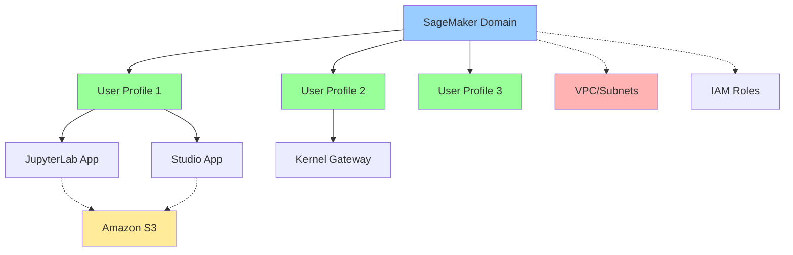
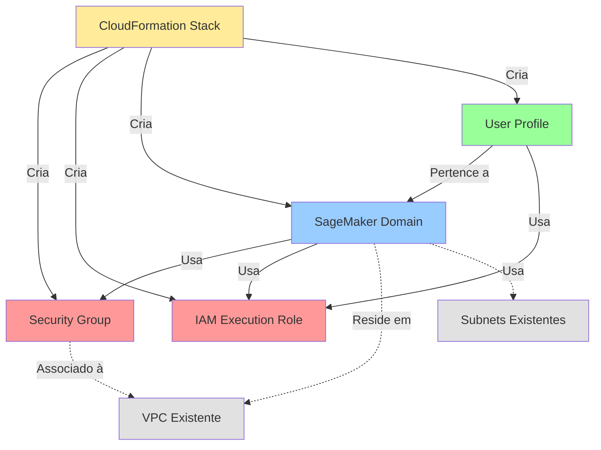

# Módulo 2: Criação do Domínio SageMaker via Infrastructure as Code

## Objetivos de Aprendizagem

Ao final deste módulo, você será capaz de:
- Entender o conceito de Infrastructure as Code (IaC)
- Compreender a estrutura de um template CloudFormation
- Criar um SageMaker Domain usando CloudFormation
- Validar a criação dos recursos no console AWS
- Solucionar problemas comuns de deploy

## Duração Estimada
45 minutos

---

## 1. Conceitos Fundamentais

### O que é Infrastructure as Code (IaC)?

Infrastructure as Code é a prática de gerenciar e provisionar recursos de infraestrutura através de código, em vez de processos manuais via console.

**Benefícios:**
- ✅ **Reprodutibilidade**: Criar ambientes idênticos múltiplas vezes
- ✅ **Versionamento**: Controlar mudanças usando Git
- ✅ **Documentação**: O código serve como documentação da infraestrutura
- ✅ **Automação**: Deploy automatizado e consistente
- ✅ **Auditoria**: Rastreabilidade completa de mudanças

### O que é AWS CloudFormation?

CloudFormation é o serviço de IaC nativo da AWS que permite:
- Definir recursos AWS em formato YAML ou JSON
- Criar, atualizar e deletar recursos como uma única unidade (stack)
- Gerenciar dependências entre recursos automaticamente

**Alternativas:** Terraform, AWS CDK, Pulumi

### O que é um SageMaker Domain?

O SageMaker Domain é o ambiente central que agrupa:
- **User Profiles**: Perfis de usuários individuais
- **Shared Spaces**: Espaços colaborativos
- **Apps**: Aplicações JupyterLab, Studio, etc.
- **Configurações**: Rede, segurança, armazenamento



---

## 2. Template Completo (Recomendado)

Para este treinamento, disponibilizamos um **template CloudFormation completo** que cria toda a infraestrutura necessária de uma só vez:

📁 **Localização:** `scripts/sagemaker-complete-infrastructure.yaml`

### O que o Template Completo Cria

| Recurso | Descrição |
|---------|-----------|
| **VPC** | Rede virtual isolada com DNS habilitado |
| **4 Subnets** | 2 públicas + 2 privadas em AZs diferentes |
| **Internet Gateway** | Acesso à internet para subnets públicas |
| **NAT Gateway** | Acesso à internet para subnets privadas |
| **Security Group** | Firewall para recursos SageMaker |
| **SageMaker Domain** | Ambiente principal do SageMaker AI |
| **User Profile** | Perfil de usuário para acesso ao Studio |
| **IAM User** | Usuário para login no console AWS |
| **IAM Role** | Permissões de execução do SageMaker |

### Deploy Rápido

```bash
# Navegar para scripts
cd scripts

# Deploy completo
aws cloudformation create-stack \
  --stack-name sagemaker-training-infrastructure \
  --template-body file://sagemaker-complete-infrastructure.yaml \
  --parameters file://parameters.json \
  --capabilities CAPABILITY_NAMED_IAM \
  --region eu-central-1

# Aguardar (10-15 minutos)
aws cloudformation wait stack-create-complete \
  --stack-name sagemaker-training-infrastructure \
  --region eu-central-1

# Ver outputs
aws cloudformation describe-stacks \
  --stack-name sagemaker-training-infrastructure \
  --query 'Stacks[0].Outputs' \
  --region eu-central-1
```

Se preferir usar o template completo, pule para a **Seção 6: Executando o Deploy** ou consulte as instruções em [scripts/README.md](../scripts/README.md).

---

## 3. Pré-requisitos (Para Deploy Modular)

Se você preferir criar os recursos separadamente ou já possui uma VPC, continue com esta seção.

### Informações de Rede
- ✅ **VPC ID**: Identificador da Virtual Private Cloud
- ✅ **Subnet IDs**: Pelo menos 2 subnets em zonas de disponibilidade diferentes
- ✅ **Security Group**: Será criado pelo template

### Permissões IAM
- ✅ Permissão para criar roles IAM
- ✅ Permissão para criar recursos SageMaker
- ✅ Permissão para criar Security Groups

### Como Obter VPC e Subnet IDs

**Via Console:**
1. Acesse o serviço **VPC**
2. No menu lateral, clique em "Your VPCs"
3. Anote o **VPC ID** (formato: vpc-xxxxxxxxx)
4. Clique em "Subnets"
5. Anote pelo menos 2 **Subnet IDs** (formato: subnet-xxxxxxxxx)

**Via AWS CLI:**
```bash
# Listar VPCs
aws ec2 describe-vpcs --region eu-central-1 --query 'Vpcs[*].[VpcId,Tags[?Key==`Name`].Value|[0]]' --output table

# Listar Subnets de uma VPC
aws ec2 describe-subnets --region eu-central-1 \
  --filters "Name=vpc-id,Values=vpc-xxxxxxxxx" \
  --query 'Subnets[*].[SubnetId,AvailabilityZone,CidrBlock]' \
  --output table
```

---

## 3. Clonando o Repositório de Infraestrutura

Se o template está em um repositório Git:

```bash
# Clonar o repositório
git clone https://github.com/seu-org/sagemaker-training-infra.git

# Navegar para o diretório
cd sagemaker-training-infra

# Verificar o template
ls -la cloudformation/
```

Para este treinamento, o template está disponível em:
📁 `cloudformation/sagemaker-domain.yaml`

---

## 4. Revisão do Template CloudFormation

### Estrutura do Template

Vamos analisar as principais seções do template:

#### 4.1 Parâmetros

```yaml
Parameters:
  DomainName:
    Type: String
    Default: 'sagemaker-training-domain'
    Description: 'Nome do SageMaker Domain'
    
  VpcId:
    Type: AWS::EC2::VPC::Id
    Description: 'ID da VPC onde o SageMaker Domain sera criado'
    
  SubnetIds:
    Type: List<AWS::EC2::Subnet::Id>
    Description: 'Lista de Subnet IDs'
```

**Parâmetros configuráveis:**
- `DomainName`: Nome único para o domain
- `VpcId`: ID da VPC existente
- `SubnetIds`: Lista de subnets
- `AuthMode`: IAM ou SSO
- `UserProfileName`: Nome do usuário inicial

#### 4.2 Recursos (Resources)

**Security Group:**
```yaml
SageMakerSecurityGroup:
  Type: AWS::EC2::SecurityGroup
  Properties:
    GroupName: !Sub '${DomainName}-sg'
    VpcId: !Ref VpcId
```

**IAM Role:**
```yaml
SageMakerExecutionRole:
  Type: AWS::IAM::Role
  Properties:
    AssumeRolePolicyDocument:
      Statement:
        - Effect: Allow
          Principal:
            Service: sagemaker.amazonaws.com
          Action: 'sts:AssumeRole'
    ManagedPolicyArns:
      - 'arn:aws:iam::aws:policy/AmazonSageMakerFullAccess'
```

**SageMaker Domain:**
```yaml
SageMakerDomain:
  Type: AWS::SageMaker::Domain
  Properties:
    DomainName: !Ref DomainName
    AuthMode: !Ref AuthMode
    DefaultUserSettings:
      ExecutionRole: !GetAtt SageMakerExecutionRole.Arn
      SecurityGroups:
        - !Ref SageMakerSecurityGroup
    SubnetIds: !Ref SubnetIds
    VpcId: !Ref VpcId
```

**User Profile:**
```yaml
SageMakerUserProfile:
  Type: AWS::SageMaker::UserProfile
  Properties:
    DomainId: !Ref SageMakerDomain
    UserProfileName: !Ref UserProfileName
```

#### 4.3 Outputs

```yaml
Outputs:
  DomainId:
    Description: 'ID do SageMaker Domain criado'
    Value: !Ref SageMakerDomain
    
  DomainUrl:
    Description: 'URL do SageMaker Domain'
    Value: !GetAtt SageMakerDomain.Url
```

Os outputs facilitam obter informações importantes após o deploy.

---

## 5. Ajustando Parâmetros

### Criando um Arquivo de Parâmetros

Crie um arquivo `parameters.json`:

```json
[
  {
    "ParameterKey": "DomainName",
    "ParameterValue": "sagemaker-training-portugal"
  },
  {
    "ParameterKey": "VpcId",
    "ParameterValue": "vpc-0123456789abcdef0"
  },
  {
    "ParameterKey": "SubnetIds",
    "ParameterValue": "subnet-0123456789abcdef0,subnet-0123456789abcdef1"
  },
  {
    "ParameterKey": "AuthMode",
    "ParameterValue": "IAM"
  },
  {
    "ParameterKey": "EnvironmentName",
    "ParameterValue": "training"
  },
  {
    "ParameterKey": "UserProfileName",
    "ParameterValue": "default-user"
  }
]
```

**⚠️ IMPORTANTE:** Substitua os valores de VPC e Subnet pelos IDs reais da sua conta!

---

## 6. Executando o Deploy

### Método 1: Via AWS CLI (Recomendado)

#### Passo 1: Validar o Template

```bash
aws cloudformation validate-template \
  --template-body file://cloudformation/sagemaker-domain.yaml \
  --region eu-central-1
```

**Saída esperada:**
```json
{
    "Parameters": [...],
    "Description": "Template para criacao do Amazon SageMaker Domain"
}
```

#### Passo 2: Criar a Stack

```bash
aws cloudformation create-stack \
  --stack-name sagemaker-training-stack \
  --template-body file://cloudformation/sagemaker-domain.yaml \
  --parameters file://parameters.json \
  --capabilities CAPABILITY_NAMED_IAM \
  --region eu-central-1
```

**Flags importantes:**
- `--capabilities CAPABILITY_NAMED_IAM`: Necessário pois o template cria IAM roles
- `--stack-name`: Nome único para identificar a stack
- `--region`: Região onde os recursos serão criados

**Saída:**
```json
{
    "StackId": "arn:aws:cloudformation:eu-central-1:123456789012:stack/sagemaker-training-stack/..."
}
```

#### Passo 3: Monitorar o Deploy

```bash
# Verificar status da stack
aws cloudformation describe-stacks \
  --stack-name sagemaker-training-stack \
  --region eu-central-1 \
  --query 'Stacks[0].StackStatus'

# Acompanhar eventos em tempo real
aws cloudformation describe-stack-events \
  --stack-name sagemaker-training-stack \
  --region eu-central-1 \
  --max-items 10
```

**Status possíveis:**
- `CREATE_IN_PROGRESS`: Criação em andamento
- `CREATE_COMPLETE`: Criação concluída com sucesso
- `CREATE_FAILED`: Falha na criação
- `ROLLBACK_IN_PROGRESS`: Revertendo mudanças após falha

**⏱️ Tempo estimado:** 10-15 minutos

#### Passo 4: Obter Outputs

```bash
aws cloudformation describe-stacks \
  --stack-name sagemaker-training-stack \
  --region eu-central-1 \
  --query 'Stacks[0].Outputs'
```

**Exemplo de saída:**
```json
[
  {
    "OutputKey": "DomainId",
    "OutputValue": "d-xxxxxxxxxxxx",
    "ExportName": "sagemaker-training-stack-DomainId"
  },
  {
    "OutputKey": "DomainUrl",
    "OutputValue": "https://d-xxxxxxxxxxxx.studio.eu-central-1.sagemaker.aws"
  }
]
```

### Método 2: Via Console AWS

#### Passo 1: Acessar CloudFormation

1. No console AWS, busque por "CloudFormation"
2. Clique em "Create stack" → "With new resources (standard)"

#### Passo 2: Especificar Template

1. Selecione "Upload a template file"
2. Clique em "Choose file" e selecione `sagemaker-domain.yaml`
3. Clique em "Next"

#### Passo 3: Configurar Stack

1. **Stack name:** `sagemaker-training-stack`
2. Preencha os parâmetros:
   - DomainName: `sagemaker-training-portugal`
   - VpcId: Selecione sua VPC
   - SubnetIds: Selecione 2+ subnets
   - AuthMode: `IAM`
   - EnvironmentName: `training`
   - UserProfileName: `default-user`
3. Clique em "Next"

#### Passo 4: Configurar Opções

1. **Tags** (opcional):
   - Key: `Project`, Value: `SageMaker-Training`
   - Key: `Owner`, Value: `[Seu Nome]`
2. **Permissions**: Deixe padrão
3. Clique em "Next"

#### Passo 5: Revisar e Criar

1. Revise todas as configurações
2. ✅ Marque "I acknowledge that AWS CloudFormation might create IAM resources"
3. Clique em "Submit"

#### Passo 6: Monitorar

1. Aguarde na aba "Events" 
2. Acompanhe a criação de cada recurso
3. Quando o status mudar para `CREATE_COMPLETE`, acesse a aba "Outputs"

---

## 7. Validação no Console AWS

### Verificar o SageMaker Domain

**Passo 1: Acessar SageMaker**
1. No console AWS, busque por "SageMaker"
2. No menu lateral, clique em "Domains"
3. Você deve ver o domain criado: `sagemaker-training-portugal`

**Passo 2: Verificar Detalhes**
1. Clique no nome do domain
2. Verifique as informações:
   - **Domain ID**: d-xxxxxxxxxxxx
   - **Status**: InService
   - **Auth mode**: IAM
   - **VPC**: vpc-xxxxxxxxxxxx

**Passo 3: Verificar User Profile**
1. Na mesma página, clique na aba "User profiles"
2. Você deve ver o perfil: `default-user`
3. Status deve ser `InService`

### Verificar IAM Role

1. Acesse o serviço **IAM**
2. No menu lateral, clique em "Roles"
3. Busque por: `sagemaker-training-portugal-execution-role`
4. Verifique as políticas anexadas:
   - AmazonSageMakerFullAccess
   - Políticas inline para S3, ECR, CloudWatch

### Verificar Security Group

1. Acesse o serviço **VPC**
2. No menu lateral, clique em "Security Groups"
3. Busque por: `sagemaker-training-portugal-sg`
4. Verifique as regras:
   - **Inbound**: Permitir tráfego do próprio security group
   - **Outbound**: Permitir todo tráfego

---

## 8. Diagrama de Recursos Criados



---

## 9. Troubleshooting - Problemas Comuns

### Erro: "The following resource(s) failed to create: [SageMakerDomain]"

**Possíveis causas:**
1. Subnets em zonas de disponibilidade insuficientes
2. VPC sem acesso à internet (NAT Gateway necessário)
3. Permissões IAM insuficientes

**Solução:**
```bash
# Verificar subnets
aws ec2 describe-subnets \
  --subnet-ids subnet-xxx subnet-yyy \
  --region eu-central-1 \
  --query 'Subnets[*].[SubnetId,AvailabilityZone]'

# Verificar se as subnets estão em AZs diferentes
# Exemplo de saída correta:
# subnet-xxx | eu-central-1a
# subnet-yyy | eu-central-1b
```

### Erro: "User is not authorized to perform: iam:CreateRole"

**Causa:** Permissões IAM insuficientes

**Solução:**
1. Contate o instrutor ou administrador AWS
2. Você precisa da política `IAMFullAccess` ou similar
3. Alternativamente, crie a role manualmente primeiro

### Erro: "Stack failed to create: ROLLBACK_COMPLETE"

**Causa:** Algum recurso falhou durante a criação

**Solução:**
```bash
# Ver detalhes do erro
aws cloudformation describe-stack-events \
  --stack-name sagemaker-training-stack \
  --region eu-central-1 \
  --query 'StackEvents[?ResourceStatus==`CREATE_FAILED`]'

# Deletar a stack com falha
aws cloudformation delete-stack \
  --stack-name sagemaker-training-stack \
  --region eu-central-1

# Aguardar deleção completa
aws cloudformation wait stack-delete-complete \
  --stack-name sagemaker-training-stack \
  --region eu-central-1

# Tentar novamente com parâmetros corrigidos
```

### Domain criado mas status "Failed"

**Causa:** Problemas de rede ou configuração

**Solução:**
1. Verifique os CloudWatch Logs
2. Verifique se a VPC tem route tables configuradas corretamente
3. Verifique se há NAT Gateway ou VPC endpoints para SageMaker

### Tempo de criação muito longo

**Comportamento esperado:** A criação do Domain pode levar 10-15 minutos

Se passar de 20 minutos:
1. Verifique os eventos da stack
2. Procure por recursos travados
3. Considere cancelar e tentar novamente

---

## 10. Comandos Úteis

### Listar Stacks

```bash
aws cloudformation list-stacks \
  --region eu-central-1 \
  --stack-status-filter CREATE_COMPLETE UPDATE_COMPLETE
```

### Obter Domain ID via CLI

```bash
aws sagemaker list-domains --region eu-central-1 --query 'Domains[0].DomainId'
```

### Atualizar Stack (após mudanças no template)

```bash
aws cloudformation update-stack \
  --stack-name sagemaker-training-stack \
  --template-body file://cloudformation/sagemaker-domain.yaml \
  --parameters file://parameters.json \
  --capabilities CAPABILITY_NAMED_IAM \
  --region eu-central-1
```

### Deletar Stack (limpeza completa)

```bash
# CUIDADO: Isso deletará TODOS os recursos
aws cloudformation delete-stack \
  --stack-name sagemaker-training-stack \
  --region eu-central-1
```

---

## 11. Boas Práticas

### Versionamento
- ✅ Mantenha templates no Git
- ✅ Use branches para testar mudanças
- ✅ Faça commit com mensagens descritivas

### Nomeação
- ✅ Use nomes descritivos para stacks
- ✅ Inclua ambiente no nome (dev, training, prod)
- ✅ Use tags para organizar recursos

### Segurança
- ✅ Siga o princípio do menor privilégio nas IAM roles
- ✅ Use Security Groups restritivos
- ✅ Habilite logs do CloudTrail

### Custos
- ✅ Use tags para rastreamento de custos
- ✅ Delete recursos não utilizados
- ✅ Configure alertas de billing

---

## 12. Checklist de Validação

Antes de prosseguir, confirme:

- [ ] Template CloudFormation validado sem erros
- [ ] Stack criada com status `CREATE_COMPLETE`
- [ ] SageMaker Domain visível no console com status `InService`
- [ ] User Profile criado e ativo
- [ ] IAM Role criada com permissões adequadas
- [ ] Security Group configurado corretamente
- [ ] Outputs da stack acessíveis

---

## 13. Recursos Adicionais

### Documentação Oficial
- [AWS CloudFormation - User Guide](https://docs.aws.amazon.com/cloudformation/)
- [SageMaker Domain - CloudFormation Reference](https://docs.aws.amazon.com/AWSCloudFormation/latest/UserGuide/aws-resource-sagemaker-domain.html)
- [CloudFormation Best Practices](https://docs.aws.amazon.com/AWSCloudFormation/latest/UserGuide/best-practices.html)

### Templates de Exemplo
- [AWS CloudFormation Sample Templates](https://github.com/awslabs/aws-cloudformation-templates)
- [SageMaker Examples](https://github.com/aws/amazon-sagemaker-examples)

---

## Próximo Módulo

Com o Domain criado, vamos adicionar usuários!

➡️ [Módulo 3: Criação de Usuários no SageMaker Domain](03-criacao-usuarios.md)

---

**Dúvidas?** Consulte o instrutor ou revise a documentação do CloudFormation.
