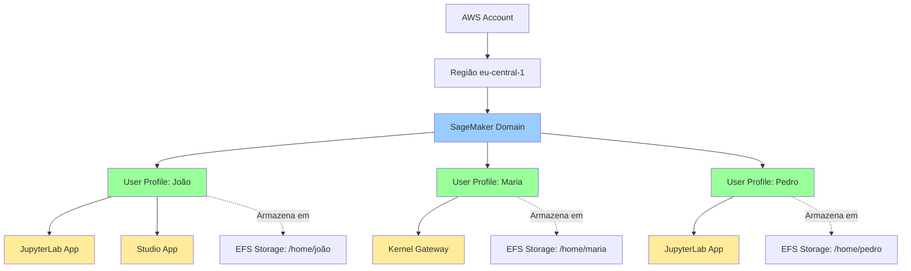

# Módulo 3: Criação de Usuários no SageMaker Domain

## Objetivos de Aprendizagem

Ao final deste módulo, você será capaz de:
- Entender o conceito de User Profile no SageMaker
- Diferenciar Domain, User Profile e Apps
- Criar usuários via console AWS
- Criar usuários via CloudFormation
- Gerenciar permissões por usuário
- Solucionar problemas comuns de acesso

## Duração Estimada
20 minutos

---

## 1. Conceitos Fundamentais

### O que é um User Profile?

Um **User Profile** é uma identidade individual dentro de um SageMaker Domain. Cada perfil de usuário:

- 🔐 Representa um único usuário ou equipe
- 📁 Tem seu próprio espaço de armazenamento isolado
- ⚙️ Pode ter configurações específicas (instâncias, imagens, roles)
- 🚀 Lança suas próprias apps (JupyterLab, Studio)

### Hierarquia de Recursos SageMaker



### Diferenças Principais

| Conceito | Descrição | Quantidade |
|----------|-----------|------------|
| **Domain** | Ambiente central compartilhado | 1 por região/conta (recomendado) |
| **User Profile** | Identidade individual | Múltiplos por Domain |
| **App** | Instância de aplicação rodando | Múltiplas por User Profile |
| **Space** | Área colaborativa compartilhada | Opcional, múltiplos por Domain |

### Por que Criar Múltiplos User Profiles?

**Casos de uso:**
- 👥 **Equipe**: Um perfil por membro da equipe
- 🔒 **Isolamento**: Separar projetos ou experimentos
- 💰 **Rastreamento**: Custos por usuário/projeto
- 🛡️ **Segurança**: Diferentes níveis de acesso

---

## 2. Configurações de User Profile

### Configurações Herdadas do Domain

Por padrão, User Profiles herdam configurações do Domain:
- ✅ VPC e Subnets
- ✅ Security Groups
- ✅ IAM Execution Role
- ✅ Configurações de rede

### Configurações Específicas do Profile

Você pode sobrescrever para cada usuário:
- 🔧 **Execution Role** diferente
- 🖥️ **Instâncias padrão** diferentes
- 🐳 **Imagens Docker** customizadas
- 📦 **Life cycle configurations** específicas

---

## 3. Criando User Profiles via Console

### Método 1: Durante Criação do Domain

Se ainda não criou o Domain, pode adicionar usuários durante a criação.

### Método 2: Adicionando Após Domain Existir

**Passo 1: Acessar o Domain**
1. No console AWS, acesse **SageMaker**
2. No menu lateral, clique em **Domains**
3. Clique no nome do seu domain (`sagemaker-training-portugal`)

**Passo 2: Adicionar User Profile**
1. Clique na aba **User profiles**
2. Clique no botão **Add user**
3. Preencha os campos:

```
┌─────────────────────────────────────────┐
│ Add user profile                        │
├─────────────────────────────────────────┤
│                                         │
│ Name: *                                 │
│ ┌─────────────────────────────────┐   │
│ │ user-joao-silva                  │   │
│ └─────────────────────────────────┘   │
│                                         │
│ Execution role: *                       │
│ ┌─────────────────────────────────┐   │
│ │ Use domain execution role ▼      │   │
│ └─────────────────────────────────┘   │
│   or                                    │
│   Create a new role                    │
│   Use existing role                    │
│                                         │
└─────────────────────────────────────────┘
```

**Passo 3: Configurações Opcionais**

Expanda **Additional settings** para configurar:

- **Default instance for Jupyter Server app:**
  - System (2 vCPU, 8 GB RAM) - padrão
  - ml.t3.medium (2 vCPU, 4 GB RAM)
  - ml.t3.large (2 vCPU, 8 GB RAM)

- **Default instance for Kernel Gateway app:**
  - ml.t3.medium (recomendado para desenvolvimento)
  - ml.m5.large (para workloads maiores)

- **Sharing settings:**
  - Notebook output: Allowed/Disabled
  - S3 output path: s3://bucket/path

**Passo 4: Criar**
1. Revise as configurações
2. Clique em **Submit**
3. Aguarde o status mudar para `InService` (1-2 minutos)

---

## 4. Criando User Profiles via CloudFormation

### Template Básico

```yaml
Resources:
  UserProfileJoao:
    Type: AWS::SageMaker::UserProfile
    Properties:
      DomainId: !Ref SageMakerDomain
      UserProfileName: user-joao-silva
      UserSettings:
        ExecutionRole: !GetAtt SageMakerExecutionRole.Arn
      Tags:
        - Key: Owner
          Value: Joao Silva
        - Key: Team
          Value: DataScience
```

### Template com Configurações Customizadas

```yaml
Resources:
  # Role específica para o usuário João
  JoaoExecutionRole:
    Type: AWS::IAM::Role
    Properties:
      RoleName: sagemaker-joao-execution-role
      AssumeRolePolicyDocument:
        Version: '2012-10-17'
        Statement:
          - Effect: Allow
            Principal:
              Service: sagemaker.amazonaws.com
            Action: 'sts:AssumeRole'
      ManagedPolicyArns:
        - 'arn:aws:iam::aws:policy/AmazonSageMakerFullAccess'
      Policies:
        - PolicyName: S3AccessLimited
          PolicyDocument:
            Version: '2012-10-17'
            Statement:
              - Effect: Allow
                Action:
                  - 's3:GetObject'
                  - 's3:PutObject'
                Resource:
                  - 'arn:aws:s3:::projeto-joao/*'

  UserProfileJoao:
    Type: AWS::SageMaker::UserProfile
    Properties:
      DomainId: d-xxxxxxxxxxxx
      UserProfileName: user-joao-silva
      UserSettings:
        ExecutionRole: !GetAtt JoaoExecutionRole.Arn
        SecurityGroups:
          - sg-xxxxxxxxxxxx
        JupyterServerAppSettings:
          DefaultResourceSpec:
            InstanceType: system
        KernelGatewayAppSettings:
          DefaultResourceSpec:
            InstanceType: ml.t3.medium
            SageMakerImageArn: !Sub 'arn:aws:sagemaker:${AWS::Region}:${AWS::AccountId}:image/datascience-1.0'
        SharingSettings:
          NotebookOutputOption: Allowed
          S3OutputPath: s3://sagemaker-outputs/joao/
      Tags:
        - Key: Owner
          Value: Joao Silva
        - Key: CostCenter
          Value: DS-Team-1
```

### Criando Múltiplos Usuários

```yaml
Parameters:
  UserNames:
    Type: CommaDelimitedList
    Default: "joao,maria,pedro"
    Description: "Lista de nomes de usuários separados por vírgula"

Resources:
  # Isso não funciona diretamente em CloudFormation
  # Você precisa criar um resource por usuário OU usar AWS CDK/Terraform
  
  UserProfileJoao:
    Type: AWS::SageMaker::UserProfile
    Properties:
      DomainId: !Ref SageMakerDomain
      UserProfileName: user-joao
      UserSettings:
        ExecutionRole: !GetAtt SageMakerExecutionRole.Arn

  UserProfileMaria:
    Type: AWS::SageMaker::UserProfile
    Properties:
      DomainId: !Ref SageMakerDomain
      UserProfileName: user-maria
      UserSettings:
        ExecutionRole: !GetAtt SageMakerExecutionRole.Arn

  UserProfilePedro:
    Type: AWS::SageMaker::UserProfile
    Properties:
      DomainId: !Ref SageMakerDomain
      UserProfileName: user-pedro
      UserSettings:
        ExecutionRole: !GetAtt SageMakerExecutionRole.Arn
```

### Deploy via CLI

```bash
aws cloudformation update-stack \
  --stack-name sagemaker-training-stack \
  --template-body file://cloudformation/sagemaker-domain-with-users.yaml \
  --parameters file://parameters.json \
  --capabilities CAPABILITY_NAMED_IAM \
  --region eu-central-1
```

---

## 5. Criando User Profiles via AWS CLI

### Comando Básico

```bash
aws sagemaker create-user-profile \
  --domain-id d-xxxxxxxxxxxx \
  --user-profile-name user-joao-silva \
  --user-settings '{
    "ExecutionRole": "arn:aws:iam::123456789012:role/SageMakerExecutionRole"
  }' \
  --region eu-central-1
```

### Com Configurações Customizadas

```bash
aws sagemaker create-user-profile \
  --domain-id d-xxxxxxxxxxxx \
  --user-profile-name user-maria-costa \
  --user-settings '{
    "ExecutionRole": "arn:aws:iam::123456789012:role/SageMakerExecutionRole",
    "SecurityGroups": ["sg-xxxxxxxxxxxx"],
    "JupyterServerAppSettings": {
      "DefaultResourceSpec": {
        "InstanceType": "system"
      }
    },
    "KernelGatewayAppSettings": {
      "DefaultResourceSpec": {
        "InstanceType": "ml.t3.medium"
      }
    },
    "SharingSettings": {
      "NotebookOutputOption": "Allowed",
      "S3OutputPath": "s3://sagemaker-outputs/maria/"
    }
  }' \
  --tags Key=Owner,Value="Maria Costa" Key=Team,Value=DataScience \
  --region eu-central-1
```

### Script para Criar Múltiplos Usuários

```bash
#!/bin/bash

DOMAIN_ID="d-xxxxxxxxxxxx"
EXECUTION_ROLE="arn:aws:iam::123456789012:role/SageMakerExecutionRole"
REGION="eu-central-1"

USERS=("joao" "maria" "pedro" "ana")

for user in "${USERS[@]}"
do
  echo "Criando user profile: user-${user}"
  
  aws sagemaker create-user-profile \
    --domain-id $DOMAIN_ID \
    --user-profile-name "user-${user}" \
    --user-settings "{
      \"ExecutionRole\": \"${EXECUTION_ROLE}\"
    }" \
    --tags Key=Owner,Value="${user}" \
    --region $REGION
    
  echo "User profile user-${user} criado com sucesso!"
done
```

---

## 6. Gerenciamento de Permissões por Usuário

### Estratégia 1: Role Compartilhada

**Vantagem:** Simples de gerenciar  
**Desvantagem:** Todos têm as mesmas permissões

```yaml
# Todos os usuários usam a mesma role
UserSettings:
  ExecutionRole: arn:aws:iam::123456789012:role/SageMakerSharedRole
```

### Estratégia 2: Role por Usuário

**Vantagem:** Controle granular  
**Desvantagem:** Mais complexo de gerenciar

```yaml
# Cada usuário tem sua própria role
UserProfileJoao:
  UserSettings:
    ExecutionRole: !GetAtt JoaoExecutionRole.Arn

UserProfileMaria:
  UserSettings:
    ExecutionRole: !GetAtt MariaExecutionRole.Arn
```

### Estratégia 3: Role por Projeto/Equipe

**Vantagem:** Balance entre controle e simplicidade  
**Desvantagem:** Requer planejamento

```yaml
# Usuários agrupados por projeto/equipe
DataScienceTeamRole:
  # Permissões completas para desenvolvimento
  
DataEngineeringTeamRole:
  # Permissões focadas em pipelines
  
InternRole:
  # Permissões limitadas para aprendizado
```

### Exemplo de Política Restrita

```json
{
  "Version": "2012-10-17",
  "Statement": [
    {
      "Effect": "Allow",
      "Action": [
        "sagemaker:CreateTrainingJob",
        "sagemaker:DescribeTrainingJob",
        "sagemaker:StopTrainingJob"
      ],
      "Resource": "*"
    },
    {
      "Effect": "Allow",
      "Action": [
        "s3:GetObject",
        "s3:PutObject"
      ],
      "Resource": [
        "arn:aws:s3:::projeto-especifico/*"
      ]
    },
    {
      "Effect": "Deny",
      "Action": [
        "sagemaker:CreateEndpoint",
        "sagemaker:CreateModel"
      ],
      "Resource": "*"
    }
  ]
}
```

---

## 7. Validação dos User Profiles

### Via Console

**Passo 1: Listar Usuários**
1. Acesse SageMaker → Domains
2. Clique no seu domain
3. Aba "User profiles"
4. Verifique o status: `InService`

**Passo 2: Verificar Detalhes**
1. Clique no nome do usuário
2. Verifique:
   - Execution role ARN
   - Default instance types
   - Creation time
   - Last modified time

### Via AWS CLI

```bash
# Listar todos os user profiles do domain
aws sagemaker list-user-profiles \
  --domain-id-equals d-xxxxxxxxxxxx \
  --region eu-central-1

# Obter detalhes de um usuário específico
aws sagemaker describe-user-profile \
  --domain-id d-xxxxxxxxxxxx \
  --user-profile-name user-joao-silva \
  --region eu-central-1

# Formato de saída mais legível
aws sagemaker describe-user-profile \
  --domain-id d-xxxxxxxxxxxx \
  --user-profile-name user-joao-silva \
  --region eu-central-1 \
  --query '{Name:UserProfileName,Status:Status,Role:UserSettings.ExecutionRole}' \
  --output table
```

**Saída esperada:**
```
------------------------------------------------------------------------------------------
|                                   DescribeUserProfile                                   |
+--------+---------------------------------------------------------------------------------+
| Name   | user-joao-silva                                                          |
| Role   | arn:aws:iam::123456789012:role/SageMakerExecutionRole                   |
| Status | InService                                                                |
+--------+---------------------------------------------------------------------------------+
```

---

## 8. Troubleshooting - Problemas Comuns

### Erro: "User profile name already exists"

**Causa:** Nome duplicado no mesmo domain

**Solução:**
```bash
# Verificar se o usuário já existe
aws sagemaker list-user-profiles \
  --domain-id-equals d-xxxxxxxxxxxx \
  --region eu-central-1 | grep "user-joao"

# Se existir, use nome diferente ou delete o existente
aws sagemaker delete-user-profile \
  --domain-id d-xxxxxxxxxxxx \
  --user-profile-name user-joao-silva \
  --region eu-central-1
```

### Erro: "Invalid execution role"

**Causa:** Role não existe ou não tem trust relationship correto

**Solução:**
```bash
# Verificar se a role existe
aws iam get-role --role-name SageMakerExecutionRole

# Verificar trust policy
aws iam get-role \
  --role-name SageMakerExecutionRole \
  --query 'Role.AssumeRolePolicyDocument'
```

**Trust policy correto:**
```json
{
  "Version": "2012-10-17",
  "Statement": [
    {
      "Effect": "Allow",
      "Principal": {
        "Service": "sagemaker.amazonaws.com"
      },
      "Action": "sts:AssumeRole"
    }
  ]
}
```

### User Profile com status "Failed"

**Causa:** Problemas de permissão ou configuração

**Solução:**
1. Delete o user profile com falha
2. Verifique os CloudWatch Logs
3. Corrija o problema
4. Recrie o user profile

```bash
# Deletar user profile com falha
aws sagemaker delete-user-profile \
  --domain-id d-xxxxxxxxxxxx \
  --user-profile-name user-com-problema \
  --region eu-central-1

# Aguardar conclusão da deleção
aws sagemaker describe-user-profile \
  --domain-id d-xxxxxxxxxxxx \
  --user-profile-name user-com-problema \
  --region eu-central-1 2>&1 | grep "Could not find"
```

### Não consigo deletar user profile

**Causa:** Apps ainda estão rodando para este usuário

**Solução:**
```bash
# Listar apps do usuário
aws sagemaker list-apps \
  --domain-id-equals d-xxxxxxxxxxxx \
  --user-profile-name-equals user-joao-silva \
  --region eu-central-1

# Deletar cada app
aws sagemaker delete-app \
  --domain-id d-xxxxxxxxxxxx \
  --user-profile-name user-joao-silva \
  --app-type JupyterServer \
  --app-name default \
  --region eu-central-1

# Aguardar apps serem deletadas, então deletar o profile
```

---

## 9. Checklist de Validação

Antes de prosseguir, confirme:

- [ ] Entendo o conceito de User Profile
- [ ] Sei a diferença entre Domain, Profile e App
- [ ] Criei pelo menos um User Profile com sucesso
- [ ] User Profile está com status `InService`
- [ ] Verifiquei a execution role associada
- [ ] Sei como listar e descrever user profiles via CLI

---

## 10. Recursos Adicionais

### Documentação Oficial
- [SageMaker User Profiles](https://docs.aws.amazon.com/sagemaker/latest/dg/domain-user-profile.html)
- [IAM Roles for SageMaker](https://docs.aws.amazon.com/sagemaker/latest/dg/sagemaker-roles.html)

### Glossário
Consulte o [Glossário](../recursos/glossario.md) para mais termos.

---

## Próximo Módulo

Agora vamos acessar o SageMaker Studio com nosso usuário!

➡️ [Módulo 4: Acesso ao SageMaker Studio](04-acesso-sagemaker-studio.md)
