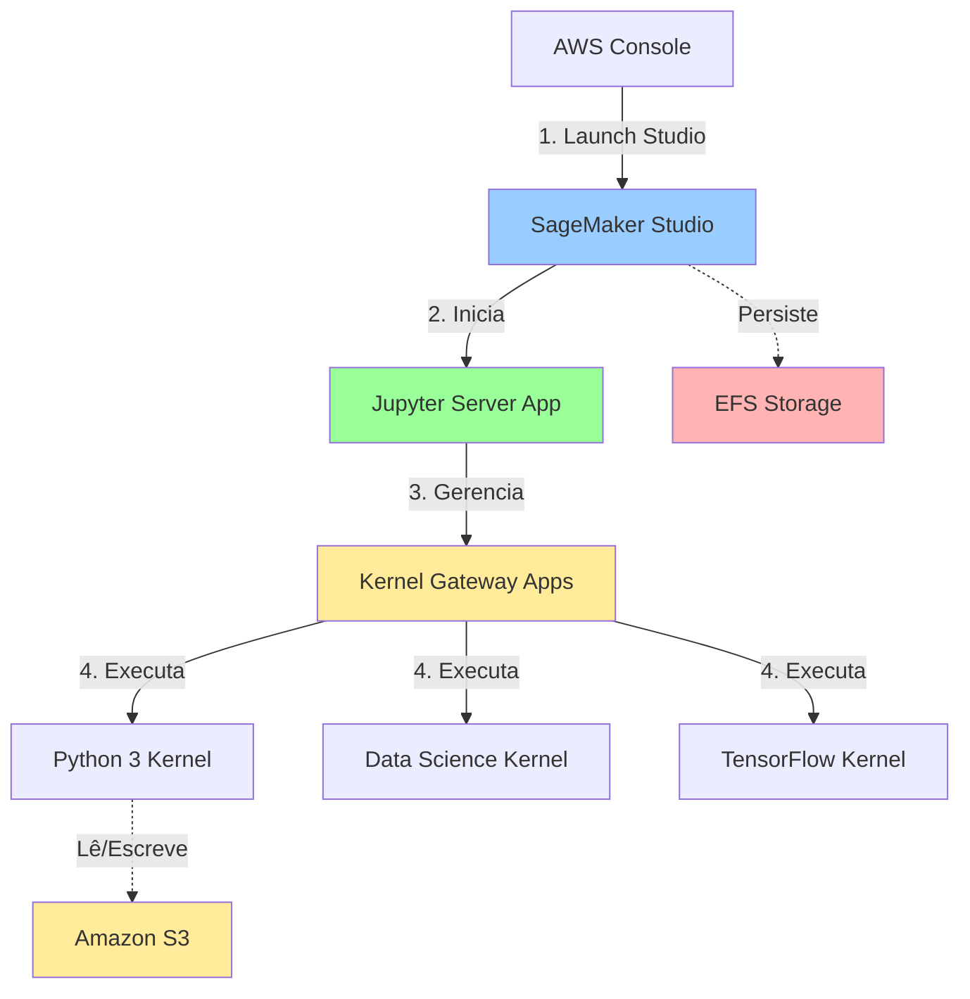
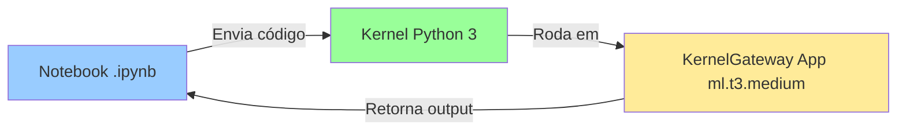
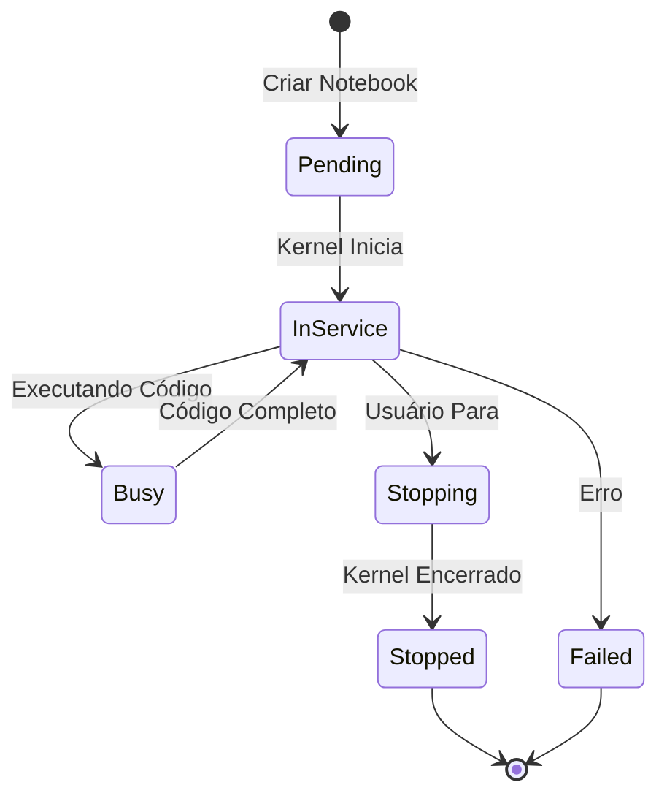

# Módulo 4: Acesso ao SageMaker Studio

## Objetivos de Aprendizagem

Ao final deste módulo, você será capaz de:
- Acessar o SageMaker Studio a partir do console AWS
- Navegar pela interface do Studio
- Entender a diferença entre JupyterLab e Studio
- Iniciar e gerenciar aplicações (Apps)
- Compreender Kernels e suas configurações
- Explorar o sistema de arquivos do Studio

## Duração Estimada
30 minutos

---

## 1. O que é Amazon SageMaker Studio?

### Visão Geral

Amazon SageMaker Studio é um ambiente de desenvolvimento integrado (IDE) baseado na web para Machine Learning. Ele fornece:

- 📓 **Notebooks Jupyter** com suporte a múltiplas linguagens
- 🔄 **MLOps** integrado para pipelines de ML
- 📊 **Experimentos** rastreamento e comparação
- 🚀 **Deployment** facilitado de modelos
- 👥 **Colaboração** compartilhamento de notebooks e recursos
- 🎨 **Interface unificada** para todo o ciclo de ML

### Arquitetura do Studio



---

## 2. SageMaker Studio vs JupyterLab

### Comparação

| Recurso | JupyterLab | SageMaker Studio |
|---------|------------|------------------|
| **Interface** | JupyterLab clássico | Interface customizada AWS |
| **Experiments** | Extensões necessárias | Integrado nativamente |
| **Debugger** | Limited | SageMaker Debugger integrado |
| **Model Registry** | Não disponível | Integrado |
| **Pipelines** | Manual | SageMaker Pipelines UI |
| **Colaboração** | Básica | Avançada com Spaces |
| **Custo** | Menor | Similar |
| **Personalização** | Alta | Média |

### Quando Usar Cada Um?

**Use JupyterLab se:**
- Prefere a interface clássica do Jupyter
- Trabalha principalmente com notebooks simples
- Quer máxima flexibilidade e customização

**Use SageMaker Studio se:**
- Precisa de integração completa com recursos AWS
- Trabalha com pipelines de ML complexos
- Colabora com equipe
- Quer rastreamento automático de experimentos

Para este treinamento, focaremos no **SageMaker Studio**.

---

## 3. Acessando o SageMaker Studio

### Método 1: Via Console AWS

**Passo 1: Navegar até SageMaker**
1. Faça login no console AWS
2. Verifique se está na região correta: **eu-central-1 (Frankfurt)**
3. Na barra de pesquisa, digite "SageMaker"
4. Clique em "Amazon SageMaker"

**Passo 2: Acessar o Domain**
1. No menu lateral esquerdo, clique em **Domains**
2. Você verá seu domain: `sagemaker-training-portugal`
3. Clique no nome do domain

**Passo 3: Selecionar User Profile**
1. Na aba **User profiles**, localize seu usuário
2. Clique no nome do usuário (ex: `default-user` ou `user-joao-silva`)

**Passo 4: Lançar Studio**
1. Clique no botão **Launch** (canto superior direito)
2. Selecione **Studio** no menu suspenso
3. Uma nova aba do navegador será aberta
4. Aguarde o carregamento inicial (pode levar 1-2 minutos na primeira vez)

```
┌────────────────────────────────────┐
│ User profile: default-user         │
├────────────────────────────────────┤
│                                    │
│  [ Launch ▼ ]                     │
│     ├─ Studio                     │
│     ├─ JupyterLab                 │
│     └─ Canvas                     │
│                                    │
└────────────────────────────────────┘
```

### Método 2: Via URL Direta

Se você tem a URL do Studio (obtida dos Outputs do CloudFormation):

```
https://d-xxxxxxxxxxxx.studio.eu-central-1.sagemaker.aws/
```

1. Cole a URL no navegador
2. Faça login se solicitado
3. Selecione seu user profile
4. O Studio será carregado

### Método 3: Via AWS CLI

```bash
# Obter a URL do domain
aws sagemaker describe-domain \
  --domain-id d-xxxxxxxxxxxx \
  --region eu-central-1 \
  --query 'Url' \
  --output text

# Criar presigned URL para acesso direto (válida por 5 minutos)
aws sagemaker create-presigned-domain-url \
  --domain-id d-xxxxxxxxxxxx \
  --user-profile-name default-user \
  --region eu-central-1 \
  --query 'AuthorizedUrl' \
  --output text
```

---

## 4. Tour pela Interface do Studio

### Layout Principal

```
┌─────────────────────────────────────────────────────────────┐
│  File  Edit  View  Run  Settings  Help         [User] ▼    │ ← Menu superior
├────────┬────────────────────────────────────────────────────┤
│        │                                                     │
│  📁   │                                                     │
│  🏠   │         Área de Trabalho Principal                 │
│  🔍   │         (Notebooks, Consoles, Terminals)           │
│  🧪   │                                                     │
│  📊   │                                                     │
│  ⚙️   │                                                     │
│        │                                                     │
│ Painel │                                                     │
│ Lateral│                                                     │
└────────┴────────────────────────────────────────────────────┘
```

### Painel Lateral Esquerdo

| Ícone | Nome | Função |
|-------|------|--------|
| 📁 | File Browser | Explorar arquivos e diretórios |
| 🏠 | Home | Página inicial do Studio |
| 🔍 | Search | Buscar em arquivos e recursos |
| 🧪 | Experiments | Gerenciar experimentos de ML |
| 📊 | SageMaker Resources | Acessar recursos (endpoints, jobs) |
| ⚙️ | Settings | Configurações do Studio |
| 🎯 | Git | Integração com repositórios Git |

### Área de Trabalho

A área central onde você:
- Abre e edita notebooks (.ipynb)
- Visualiza consoles Python
- Usa terminals bash
- Visualiza gráficos e métricas
- Compara experimentos

### Barra Superior

- **File, Edit, View...**: Menus padrão
- **Running Terminals and Kernels**: Ver processos ativos
- **User dropdown**: Configurações do usuário

---

## 5. Conceitos: Apps e Kernels

### O que são Apps?

**Apps** são aplicações em execução no SageMaker Studio:

1. **JupyterServer App**
   - Interface principal do Studio
   - Uma por user profile
   - Custo: instância pequena (system)

2. **KernelGateway Apps**
   - Executam kernels de notebooks
   - Múltiplas por usuário
   - Custo: depende da instância escolhida

3. **Other Apps**
   - Canvas, Data Wrangler, etc.

### O que são Kernels?

**Kernels** são ambientes de execução de código:



**Kernels disponíveis:**
- **Python 3**: Kernel básico
- **Data Science**: Inclui pandas, scikit-learn, matplotlib
- **TensorFlow**: Otimizado para TensorFlow
- **PyTorch**: Otimizado para PyTorch
- **R**: Para código R
- **Custom**: Você pode criar seus próprios

### Ciclo de Vida



---

## 6. Iniciando Seu Primeiro Notebook

### Passo 1: Criar Novo Notebook

1. No menu **File**, clique em **New** → **Notebook**
2. Ou clique no botão **+** na barra de ferramentas
3. Ou use atalho: `Ctrl+Shift+N` (Windows/Linux) ou `Cmd+Shift+N` (Mac)

### Passo 2: Selecionar Kernel e Instância

Uma janela aparecerá:

```
┌─────────────────────────────────────┐
│ Select Kernel and Instance          │
├─────────────────────────────────────┤
│                                     │
│ Image:                              │
│ ┌─────────────────────────────┐   │
│ │ Data Science ▼               │   │
│ └─────────────────────────────┘   │
│                                     │
│ Kernel:                             │
│ ┌─────────────────────────────┐   │
│ │ Python 3 ▼                   │   │
│ └─────────────────────────────┘   │
│                                     │
│ Instance type:                      │
│ ┌─────────────────────────────┐   │
│ │ ml.t3.medium (2 vCPU, 4 GB) ▼│   │
│ └─────────────────────────────┘   │
│                                     │
│ Start-up script: (optional)         │
│ ┌─────────────────────────────┐   │
│ │ None                         │   │
│ └─────────────────────────────┘   │
│                                     │
│         [Cancel]     [Select]       │
└─────────────────────────────────────┘
```

**Recomendação para começar:**
- **Image**: Data Science
- **Kernel**: Python 3
- **Instance**: ml.t3.medium

3. Clique em **Select**
4. Aguarde o kernel iniciar (15-30 segundos)

### Passo 3: Escrever Código

```python
# Sua primeira célula no SageMaker Studio!
print("Hello, SageMaker Studio!")

# Verificar versão do Python
import sys
print(f"Python version: {sys.version}")

# Verificar pacotes instalados
import pandas as pd
import numpy as np
import matplotlib.pyplot as plt

print(f"Pandas version: {pd.__version__}")
print(f"NumPy version: {np.__version__}")
```

### Passo 4: Executar Código

- Clique no botão ▶️ (Run)
- Ou pressione `Shift+Enter`
- Ou menu **Run** → **Run Selected Cells**

---

## 7. Explorando o Sistema de Arquivos

### Estrutura de Diretórios

```
/home/sagemaker-user/
├── .aws/                    # Configurações AWS CLI
├── .jupyter/                # Configurações Jupyter
├── .local/                  # Pacotes Python locais
├── work/                    # Seus arquivos (persistidos)
│   ├── notebooks/
│   ├── data/
│   └── models/
└── tmp/                     # Arquivos temporários
```

### EFS - Elastic File System

Seus arquivos são armazenados em **Amazon EFS** (Elastic File System):

**Características:**
- ✅ **Persistente**: Arquivos são mantidos entre sessões
- ✅ **Privado**: Isolado por user profile
- ✅ **Tamanho**: Cresce automaticamente conforme necessário
- ⚠️ **Custo**: Cobrado por GB armazenado ($0.30/GB-mês em eu-central-1)

### Navegando pelo File Browser

**No painel lateral:**
1. Clique no ícone 📁 (File Browser)
2. Você verá seu diretório home
3. Clique direito para criar pastas ou arquivos
4. Arraste e solte arquivos do seu computador

### Usando o Terminal

**Abrir terminal:**
1. Menu **File** → **New** → **Terminal**
2. Ou clique no ícone **+** → **Terminal**

```bash
# Verificar diretório atual
pwd
# Output: /home/sagemaker-user

# Listar arquivos
ls -la

# Criar estrutura de diretórios
mkdir -p work/{notebooks,data,models,scripts}

# Verificar espaço disponível
df -h

# Verificar região AWS
aws configure get region

# Listar buckets S3
aws s3 ls
```

---

## 8. Gerenciando Apps e Kernels

### Ver Apps em Execução

**Via Studio:**
1. Menu **File** → **Manage Apps and Terminals**
2. Ou clique no ícone ⏸️ na barra inferior

Você verá:
- **JupyterServer**: system (sempre rodando)
- **KernelGateway**: ml.t3.medium (quando você abre notebook)

**Via Console AWS:**
1. SageMaker → Domains → Seu Domain → User profiles
2. Clique no usuário → Aba **Apps**

**Via CLI:**
```bash
aws sagemaker list-apps \
  --domain-id-equals d-xxxxxxxxxxxx \
  --user-profile-name-equals default-user \
  --region eu-central-1
```

### Parar Kernel

**Opção 1: Parar Kernel Individual**
1. No notebook, menu **Kernel** → **Shut Down Kernel**

**Opção 2: Parar Todos os Kernels**
1. **File** → **Manage Apps and Terminals**
2. Selecione os kernels
3. Clique em **Shut Down**

### Parar Apps

**⚠️ IMPORTANTE:** Sempre pare apps não utilizadas para evitar custos!

**Via Studio:**
1. **File** → **Manage Apps and Terminals**
2. Localize a **KernelGateway** app
3. Clique em **Shut down**
4. Confirme a ação

**Via Console:**
1. SageMaker → Domains → User profile → Apps
2. Selecione a app
3. **Actions** → **Delete**

**Via CLI:**
```bash
aws sagemaker delete-app \
  --domain-id d-xxxxxxxxxxxx \
  --user-profile-name default-user \
  --app-type KernelGateway \
  --app-name datascience-1-0-ml-t3-medium-xxxxxxxxxxxx \
  --region eu-central-1
```

---

## 9. Configurações e Preferências

### Tema Visual

1. Menu **Settings** → **Theme**
2. Escolha:
   - **JupyterLab Light**
   - **JupyterLab Dark**
   - **SageMaker Studio Light**
   - **SageMaker Studio Dark**

### Atalhos de Teclado

Menu **Settings** → **Advanced Settings Editor** → **Keyboard Shortcuts**

**Atalhos úteis:**
| Ação | Atalho |
|------|--------|
| Executar célula | `Shift+Enter` |
| Inserir célula abaixo | `B` (modo comando) |
| Inserir célula acima | `A` (modo comando) |
| Deletar célula | `DD` (modo comando) |
| Mudar para Markdown | `M` (modo comando) |
| Mudar para Code | `Y` (modo comando) |
| Salvar notebook | `Ctrl+S` / `Cmd+S` |

### Extensões

Menu **Settings** → **Extension Manager**

Extensões úteis:
- Git integration
- Table of Contents
- Variable Inspector
- Debugger

---

## 10. Integração com Git

### Clonar Repositório

**Via Interface:**
1. Clique no ícone Git (🎯) no painel lateral
2. Clique em **Clone a Repository**
3. Cole a URL do repositório Git
4. Clique em **Clone**

**Via Terminal:**
```bash
cd ~/work
git clone https://github.com/usuario/projeto-ml.git
cd projeto-ml
```

### Configurar Credenciais

```bash
git config --global user.name "Seu Nome"
git config --global user.email "seu@email.com"

# Para repositórios privados, use HTTPS com token
git config --global credential.helper store
```

---

## 11. Troubleshooting

### Studio não carrega

**Causa:** Problemas de rede ou apps travadas

**Solução:**
1. Limpe o cache do navegador
2. Tente em janela anônima
3. Verifique VPC e Security Group
4. Delete apps via console e tente novamente

### Kernel não inicia

**Causa:** Falta de capacidade ou problemas de instância

**Solução:**
```bash
# Via CLI, force deleção da app
aws sagemaker delete-app \
  --domain-id d-xxxxxxxxxxxx \
  --user-profile-name default-user \
  --app-type KernelGateway \
  --app-name [nome-da-app] \
  --region eu-central-1

# Tente instância diferente no Studio
```

### Arquivos não aparecem

**Causa:** EFS mount issues

**Solução:**
1. Recarregue a página
2. Verifique permissões do user profile
3. No terminal: `ls -la /home/sagemaker-user/`

### "Out of memory" error

**Causa:** Instância muito pequena para os dados

**Solução:**
1. Salve seu trabalho
2. Pare o kernel atual
3. Inicie novo notebook com instância maior (ml.m5.large ou ml.m5.xlarge)

---

## 12. Checklist de Validação

- [ ] Consegui acessar o SageMaker Studio
- [ ] Entendo a interface do Studio
- [ ] Criei e executei um notebook
- [ ] Sei selecionar kernel e instância
- [ ] Explorei o file browser
- [ ] Abri e usei o terminal
- [ ] Sei como parar apps e kernels
- [ ] Configurei tema e preferências

---

## 13. Recursos Adicionais

### Documentação
- [SageMaker Studio Overview](https://docs.aws.amazon.com/sagemaker/latest/dg/studio.html)
- [SageMaker Studio Notebooks](https://docs.aws.amazon.com/sagemaker/latest/dg/notebooks.html)

---

## Próximo Módulo

Agora vamos aprofundar em instâncias de trabalho!

➡️ [Módulo 5: Instâncias de Trabalho](05-instancias-trabalho.md)
