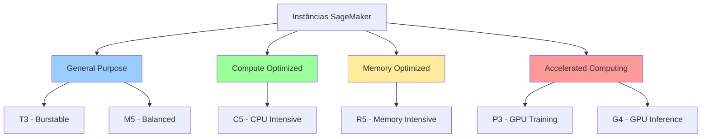
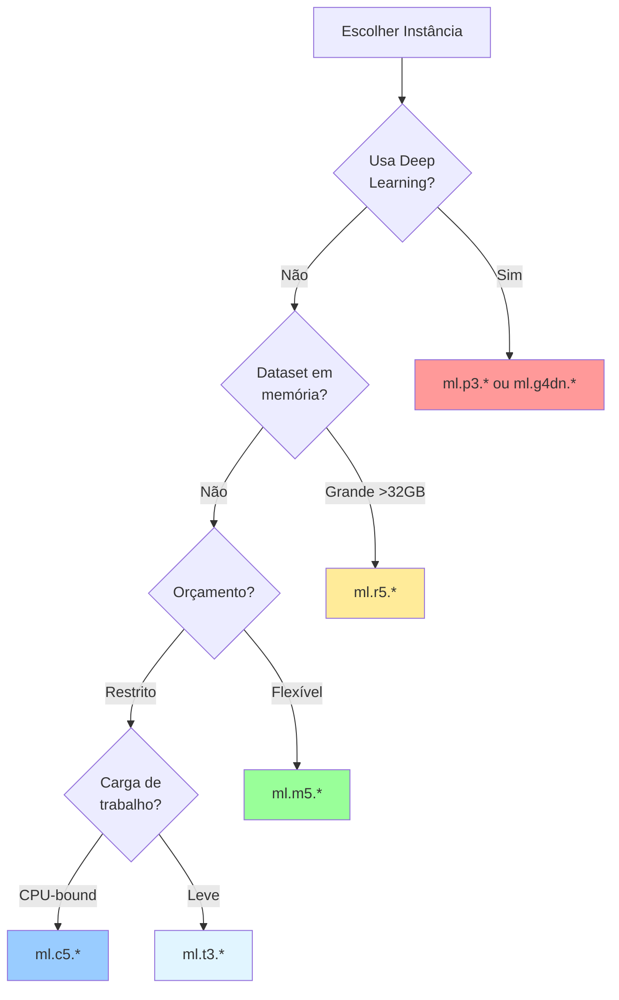

# Módulo 5: Instâncias de Trabalho no SageMaker

## Objetivos de Aprendizagem

Ao final deste módulo, você será capaz de:
- Entender os tipos de instâncias EC2 disponíveis
- Selecionar a instância adequada para cada tarefa
- Compreender a estrutura de custos
- Iniciar e parar instâncias eficientemente
- Monitorar recursos utilizados
- Otimizar custos de computação

## Duração Estimada
25 minutos

---

## 1. Conceitos Fundamentais

### O que são Instâncias?

Uma **instância** é uma máquina virtual com recursos computacionais dedicados:

- **vCPU**: Processadores virtuais
- **RAM**: Memória
- **Armazenamento**: Disco (EBS)
- **Rede**: Largura de banda
- **GPU** (opcional): Para deep learning

### Tipos de Instâncias no SageMaker

No SageMaker, instâncias são usadas em:

1. **Notebooks** (KernelGateway Apps)
   - Para desenvolvimento interativo
   - Você escolhe a instância ao criar o notebook
   - Prefixo: `ml.`

2. **Training Jobs**
   - Para treinar modelos
   - Configurado programaticamente
   - Pode usar múltiplas instâncias

3. **Endpoints** (Inference)
   - Para servir modelos em produção
   - Alta disponibilidade
   - Auto-scaling disponível

Neste módulo, focamos em **instâncias para notebooks**.

---

## 2. Famílias de Instâncias

### Categorias Principais



### 2.1 General Purpose (Uso Geral)

#### ml.t3.* - Burstable Performance

**Características:**
- 💰 Mais barato
- ⚡ Performance "burstable" (rajadas)
- 🎯 Ideal para desenvolvimento e testes

**Quando usar:**
- Desenvolvimento inicial
- Notebooks exploratórios
- Workloads leves
- Prototipagem

**Modelos disponíveis:**

| Instância | vCPU | RAM | Custo/hora (eu-central-1)* |
|-----------|------|-----|----------------------------|
| ml.t3.medium | 2 | 4 GB | ~$0.05 |
| ml.t3.large | 2 | 8 GB | ~$0.10 |
| ml.t3.xlarge | 4 | 16 GB | ~$0.19 |
| ml.t3.2xlarge | 8 | 32 GB | ~$0.38 |

*Valores aproximados, verifique preços atuais

#### ml.m5.* - Balanced

**Características:**
- ⚖️ Balance entre CPU e memória
- 📈 Performance consistente
- 🔧 Versátil para maioria dos casos

**Quando usar:**
- Treino de modelos médios
- Processamento de dados moderado
- Workloads de produção

**Modelos disponíveis:**

| Instância | vCPU | RAM | Custo/hora (eu-central-1)* |
|-----------|------|-----|----------------------------|
| ml.m5.large | 2 | 8 GB | ~$0.12 |
| ml.m5.xlarge | 4 | 16 GB | ~$0.23 |
| ml.m5.2xlarge | 8 | 32 GB | ~$0.46 |
| ml.m5.4xlarge | 16 | 64 GB | ~$0.92 |
| ml.m5.12xlarge | 48 | 192 GB | ~$2.76 |

### 2.2 Compute Optimized (Otimizado para CPU)

#### ml.c5.* - CPU Intensive

**Características:**
- 🚀 Alta performance de CPU
- 🧮 Ideal para computação intensiva
- 📊 Menor quantidade de RAM por vCPU

**Quando usar:**
- Treino de modelos ML clássicos (XGBoost, Random Forest)
- Processamento batch pesado
- Simulações

**Modelos disponíveis:**

| Instância | vCPU | RAM | Custo/hora* |
|-----------|------|-----|-------------|
| ml.c5.large | 2 | 4 GB | ~$0.11 |
| ml.c5.xlarge | 4 | 8 GB | ~$0.22 |
| ml.c5.2xlarge | 8 | 16 GB | ~$0.43 |
| ml.c5.4xlarge | 16 | 32 GB | ~$0.86 |

### 2.3 Memory Optimized (Otimizado para Memória)

#### ml.r5.* - Memory Intensive

**Características:**
- 🧠 Grande quantidade de RAM
- 📦 Para datasets grandes em memória
- 💵 Mais caro

**Quando usar:**
- Datasets muito grandes
- Processamento in-memory
- Analytics com Spark

**Modelos disponíveis:**

| Instância | vCPU | RAM | Custo/hora* |
|-----------|------|-----|-------------|
| ml.r5.large | 2 | 16 GB | ~$0.15 |
| ml.r5.xlarge | 4 | 32 GB | ~$0.30 |
| ml.r5.2xlarge | 8 | 64 GB | ~$0.60 |
| ml.r5.4xlarge | 16 | 128 GB | ~$1.20 |

### 2.4 Accelerated Computing (Com GPU)

#### ml.p3.* - GPU Training

**Características:**
- 🎮 GPUs NVIDIA V100
- 🚀 Para deep learning
- 💰💰 Muito caro

**Quando usar:**
- Treino de redes neurais profundas
- Computer vision
- NLP com transformers

**Modelos disponíveis:**

| Instância | vCPU | RAM | GPUs | GPU Memory | Custo/hora* |
|-----------|------|-----|------|------------|-------------|
| ml.p3.2xlarge | 8 | 61 GB | 1 | 16 GB | ~$3.82 |
| ml.p3.8xlarge | 32 | 244 GB | 4 | 64 GB | ~$15.28 |
| ml.p3.16xlarge | 64 | 488 GB | 8 | 128 GB | ~$30.56 |

#### ml.g4dn.* - GPU Inference

**Características:**
- 🎮 GPUs NVIDIA T4
- 💰 Mais barato que P3
- 🎯 Otimizado para inferência

**Quando usar:**
- Inferência com modelos de deep learning
- Desenvolvimento com GPU (mais econômico)

---

## 3. Guia de Seleção de Instância

### Matriz de Decisão



### Regras Práticas

**Para começar:**
- 👉 Use `ml.t3.medium` para exploração inicial
- 👉 Escale para `ml.m5.large` quando necessário
- 👉 Só use GPU quando realmente precisar

**Sinais de que precisa upgrade:**
- ⚠️ "Out of Memory" errors
- ⚠️ Processamento muito lento (>30min)
- ⚠️ Notebook trava frequentemente

**Sinais de que pode downgrade:**
- ✅ CPU/RAM com <50% uso
- ✅ Tarefas completam rapidamente
- ✅ Notebook ocioso frequentemente

---

## 4. Custos e Billing

### Modelo de Cobrança

**No SageMaker:**
- 💵 Cobrado por **segundo** de uso
- 📊 Mínimo: 1 minuto
- ⏹️ Para de cobrar quando você para a instância

**Exemplo de cálculo:**
```
Instância: ml.m5.xlarge
Custo: $0.23/hora
Uso: 2 horas e 30 minutos

Cálculo: $0.23 × 2.5 = $0.575
```

### Comparação de Custos Mensais

Assumindo **8 horas/dia, 20 dias/mês**:

| Instância | $/hora | $/dia (8h) | $/mês (160h) |
|-----------|--------|------------|--------------|
| ml.t3.medium | $0.05 | $0.40 | $8.00 |
| ml.t3.large | $0.10 | $0.80 | $16.00 |
| ml.m5.large | $0.12 | $0.96 | $19.20 |
| ml.m5.xlarge | $0.23 | $1.84 | $36.80 |
| ml.m5.2xlarge | $0.46 | $3.68 | $73.60 |
| ml.c5.2xlarge | $0.43 | $3.44 | $68.80 |
| ml.r5.2xlarge | $0.60 | $4.80 | $96.00 |
| ml.p3.2xlarge | $3.82 | $30.56 | $611.20 |

**⚠️ IMPORTANTE:** Sempre pare instâncias não utilizadas!

### Calculando Custos

**AWS Pricing Calculator:**
https://calculator.aws/#/addService/SageMaker

**Via AWS CLI:**
```bash
# Obter preços de instâncias SageMaker em eu-central-1
aws pricing get-products \
  --service-code AmazonSageMaker \
  --region us-east-1 \
  --filters \
    "Type=TERM_MATCH,Field=location,Value=EU (Frankfurt)" \
    "Type=TERM_MATCH,Field=instanceType,Value=ml.m5.xlarge" \
  --max-results 1
```

---

## 5. Iniciando e Parando Instâncias

### Iniciar Notebook com Instância Específica

**Ao criar notebook:**
1. **File** → **New** → **Notebook**
2. Selecione **Image** (ex: Data Science)
3. Selecione **Kernel** (ex: Python 3)
4. **Instance type**: Escolha a instância
5. Clique **Select**

**Trocar instância de notebook existente:**

⚠️ Não é possível trocar diretamente. Você precisa:
1. Salvar o notebook
2. Fechar o notebook (parar kernel)
3. Parar a KernelGateway App
4. Reabrir o notebook
5. Selecionar nova instância

### Parar Instância

**Método 1: Shutdown Kernel**
```
Menu → Kernel → Shut Down Kernel
```
Isso para o kernel mas mantém a KernelGateway App rodando.

**Método 2: Parar App Completa**
```
File → Manage Apps and Terminals → Shut down app
```
Isso para completamente a instância.

**Método 3: Auto-shutdown**

Configure no terminal:
```bash
# Instalar extensão
pip install sagemaker-studio-auto-shutdown-extension

# Configurar auto-shutdown após 60 minutos de inatividade
echo '{"idle_time": 60}' > /home/sagemaker-user/.auto-shutdown-config.json
```

### Verificar Status

**Via Console:**
1. SageMaker → Domains → User profile → Apps

**Via CLI:**
```bash
aws sagemaker list-apps \
  --domain-id-equals d-xxxxxxxxxxxx \
  --user-profile-name-equals default-user \
  --region eu-central-1 \
  --query 'Apps[*].[AppType,AppName,Status,InstanceType]' \
  --output table
```

---

## 6. Monitoramento de Recursos

### Dentro do Notebook

#### Verificar CPU e Memória

```python
import psutil
import GPUtil

# CPU
cpu_percent = psutil.cpu_percent(interval=1)
cpu_count = psutil.cpu_count()
print(f"CPU Usage: {cpu_percent}% | CPUs: {cpu_count}")

# Memória
memory = psutil.virtual_memory()
print(f"Memory: {memory.percent}% | Available: {memory.available / (1024**3):.2f} GB")

# Disco
disk = psutil.disk_usage('/')
print(f"Disk: {disk.percent}% | Free: {disk.free / (1024**3):.2f} GB")
```

#### Verificar GPU (se disponível)

```python
try:
    gpus = GPUtil.getGPUs()
    for gpu in gpus:
        print(f"GPU {gpu.id}: {gpu.name}")
        print(f"  Load: {gpu.load*100:.1f}%")
        print(f"  Memory: {gpu.memoryUtil*100:.1f}% | Free: {gpu.memoryFree}MB")
except:
    print("No GPU available")
```

### Via CloudWatch

**Métricas disponíveis:**
- CPUUtilization
- MemoryUtilization
- DiskUtilization

**Acessar:**
1. CloudWatch → Metrics → SageMaker
2. Selecione o domain e user profile
3. Visualize gráficos

**Via CLI:**
```bash
aws cloudwatch get-metric-statistics \
  --namespace AWS/SageMaker \
  --metric-name CPUUtilization \
  --dimensions Name=DomainId,Value=d-xxxxxxxxxxxx Name=UserProfileName,Value=default-user \
  --start-time 2026-02-05T00:00:00Z \
  --end-time 2026-02-05T23:59:59Z \
  --period 3600 \
  --statistics Average \
  --region eu-central-1
```

---

## 7. Otimização de Custos

### Melhores Práticas

#### 1. Use Instâncias Menores para Desenvolvimento

```python
# ❌ Ruim: Usar ml.p3.2xlarge para exploração
# Custo: $3.82/hora

# ✅ Bom: Começar com ml.t3.medium
# Custo: $0.05/hora
# Escalar quando necessário
```

#### 2. Pare Instâncias Não Utilizadas

**Configurar alarme:**
```bash
# Criar alarme para apps rodando >2 horas
aws cloudwatch put-metric-alarm \
  --alarm-name sagemaker-app-running-too-long \
  --alarm-description "Alert when app runs > 2 hours" \
  --metric-name NumberOfRunningApps \
  --namespace Custom/SageMaker \
  --statistic Sum \
  --period 3600 \
  --evaluation-periods 2 \
  --threshold 1 \
  --comparison-operator GreaterThanThreshold \
  --region eu-central-1
```

#### 3. Use Spot Instances para Training

```python
from sagemaker.estimator import Estimator

estimator = Estimator(
    image_uri='...',
    role='...',
    instance_count=1,
    instance_type='ml.m5.xlarge',
    use_spot_instances=True,  # ✅ Economize até 90%
    max_run=3600,
    max_wait=7200,
)
```

#### 4. Monitore Custos

**Configurar Budget:**
```bash
aws budgets create-budget \
  --account-id 123456789012 \
  --budget file://budget.json \
  --notifications-with-subscribers file://notifications.json
```

**budget.json:**
```json
{
  "BudgetName": "SageMaker-Monthly-Budget",
  "BudgetLimit": {
    "Amount": "100",
    "Unit": "USD"
  },
  "TimeUnit": "MONTHLY",
  "BudgetType": "COST",
  "CostFilters": {
    "Service": ["Amazon SageMaker"]
  }
}
```

---

## 8. Troubleshooting

### Erro: "InsufficientInstanceCapacity"

**Causa:** AWS não tem capacidade disponível

**Solução:**
1. Tente instância diferente da mesma família
2. Tente em horário diferente
3. Tente região diferente (se aplicável)

### Notebook muito lento

**Diagnóstico:**
```python
import psutil

# Verificar gargalo
memory = psutil.virtual_memory()
cpu = psutil.cpu_percent(interval=1)

if memory.percent > 80:
    print("⚠️ Memória alta! Considere ml.m5.xlarge ou maior")
elif cpu > 80:
    print("⚠️ CPU alta! Considere ml.c5.xlarge ou maior")
else:
    print("✅ Recursos OK. Problema pode ser I/O ou rede")
```

### "Kernel died" error

**Causas comuns:**
1. Out of Memory (OOM)
2. Segmentation fault no código
3. Instância muito pequena

**Solução:**
```python
# Antes do código problemático, monitore memória
import tracemalloc

tracemalloc.start()

# ... seu código ...

current, peak = tracemalloc.get_traced_memory()
print(f"Current: {current / 1024**2:.1f}MB | Peak: {peak / 1024**2:.1f}MB")
tracemalloc.stop()
```

---

## 9. Checklist de Validação

- [ ] Entendo as famílias de instâncias
- [ ] Sei selecionar instância adequada para minha tarefa
- [ ] Compreendo os custos associados
- [ ] Sei iniciar notebook com instância específica
- [ ] Sei parar instâncias não utilizadas
- [ ] Posso monitorar uso de recursos
- [ ] Conheço práticas de otimização de custos

---

## 10. Recursos Adicionais

### Documentação
- [SageMaker Pricing](https://aws.amazon.com/sagemaker/pricing/)
- [Instance Types](https://aws.amazon.com/sagemaker/pricing/instance-types/)
- [Cost Optimization](https://docs.aws.amazon.com/sagemaker/latest/dg/inference-cost-optimization.html)

### Ferramentas
- [AWS Pricing Calculator](https://calculator.aws/)
- [Instance Advisor](https://aws.amazon.com/ec2/instance-types/)

---

## Próximo Módulo

Agora vamos aprender a trabalhar com dados no S3!

➡️ [Módulo 6: Upload de Datasets](06-upload-datasets.md)
