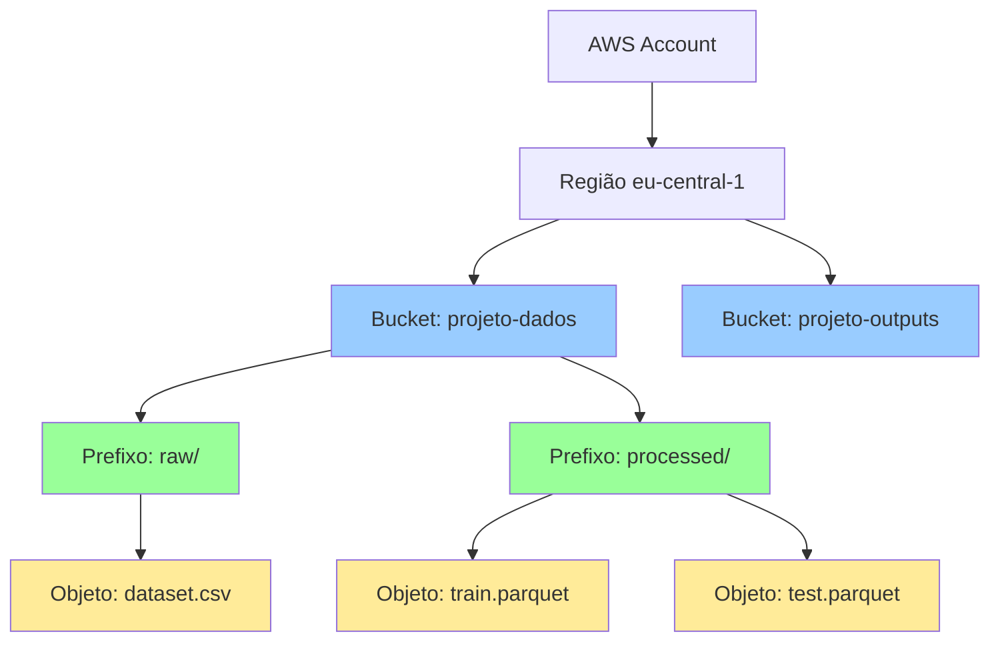

# Módulo 6: Upload de Datasets para o Ambiente SageMaker

## Objetivos de Aprendizagem

Ao final deste módulo, você será capaz de:
- Compreender conceitos fundamentais do Amazon S3
- Criar e configurar buckets S3 para ML
- Fazer upload de dados por múltiplos métodos
- Organizar datasets seguindo boas práticas
- Acessar dados do S3 dentro do SageMaker
- Otimizar performance de leitura/escrita

## Duração Estimada
40 minutos

---

## 1. Introdução ao Amazon S3

### O que é Amazon S3?

Amazon Simple Storage Service (S3) é um serviço de armazenamento de objetos que oferece:

- 📦 **Armazenamento ilimitado** escalável
- 🔒 **Durabilidade** de 99.999999999% (11 noves)
- 🌍 **Disponibilidade** global
- 💰 **Custo baixo** ($0.023/GB-mês em eu-central-1)
- 🚀 **Alta performance** para ML workloads

### Conceitos Fundamentais



**Hierarquia:**
- **Bucket**: Container principal (como um "drive")
- **Prefixo**: Simula pastas (ex: `raw/`, `processed/`)
- **Objeto**: Arquivo individual (ex: `dataset.csv`)
- **Key**: Caminho completo do objeto (ex: `raw/dataset.csv`)

### Por que S3 para Machine Learning?

✅ **Vantagens:**
- Integração nativa com SageMaker
- Escala automaticamente
- Suporta datasets de qualquer tamanho
- Versionamento de dados
- Compartilhamento fácil entre equipes
- Backup e disaster recovery

---

## 2. Criando Buckets S3

### Nomenclatura de Buckets

**Regras:**
- ✅ Único globalmente (em toda AWS)
- ✅ 3-63 caracteres
- ✅ Apenas letras minúsculas, números, hífens
- ❌ Não pode começar com hífen
- ❌ Não pode ter caracteres especiais

**Padrão recomendado:**
```
[projeto]-[ambiente]-[propósito]-[account-id]-[região]

Exemplos:
sagemaker-training-data-123456789012-eu-central-1
sagemaker-training-outputs-123456789012-eu-central-1
```

### Método 1: Via Console AWS

**Passo 1: Acessar S3**
1. Console AWS → Buscar "S3"
2. Clique em **"Create bucket"**

**Passo 2: Configurações Básicas**
```
Bucket name: sagemaker-training-data-[SEU-ACCOUNT-ID]-eu-central-1
AWS Region: Europe (Frankfurt) eu-central-1
```

**Passo 3: Configurações de Bloqueio**
```
Block all public access: ✓ (RECOMENDADO)
```

**Passo 4: Versionamento**
```
Bucket Versioning: Enable (recomendado para dados importantes)
```

**Passo 5: Criptografia**
```
Default encryption: 
  ✓ Server-side encryption with Amazon S3 managed keys (SSE-S3)
```

**Passo 6: Criar**
- Revise e clique em **"Create bucket"**

### Método 2: Via AWS CLI

```bash
# Obter account ID
ACCOUNT_ID=$(aws sts get-caller-identity --query Account --output text)

# Criar bucket
aws s3 mb s3://sagemaker-training-data-${ACCOUNT_ID}-eu-central-1 \
  --region eu-central-1

# Habilitar versionamento
aws s3api put-bucket-versioning \
  --bucket sagemaker-training-data-${ACCOUNT_ID}-eu-central-1 \
  --versioning-configuration Status=Enabled

# Habilitar criptografia
aws s3api put-bucket-encryption \
  --bucket sagemaker-training-data-${ACCOUNT_ID}-eu-central-1 \
  --server-side-encryption-configuration '{
    "Rules": [{
      "ApplyServerSideEncryptionByDefault": {
        "SSEAlgorithm": "AES256"
      }
    }]
  }'

# Bloquear acesso público
aws s3api put-public-access-block \
  --bucket sagemaker-training-data-${ACCOUNT_ID}-eu-central-1 \
  --public-access-block-configuration \
    "BlockPublicAcls=true,IgnorePublicAcls=true,BlockPublicPolicy=true,RestrictPublicBuckets=true"
```

### Método 3: Via CloudFormation

Use o template fornecido:

```bash
aws cloudformation create-stack \
  --stack-name sagemaker-s3-buckets \
  --template-body file://cloudformation/s3-bucket.yaml \
  --parameters \
    ParameterKey=ProjectName,ParameterValue=sagemaker-training \
    ParameterKey=EnvironmentName,ParameterValue=training \
  --region eu-central-1
```

Este template cria:
- ✅ Bucket de dados
- ✅ Bucket de outputs
- ✅ Bucket de logs
- ✅ Políticas de segurança
- ✅ Lifecycle rules

---

## 3. Organizando Datasets

### Estrutura Recomendada

```
s3://sagemaker-training-data-xxxxx/
├── raw/                      # Dados originais (imutáveis)
│   ├── dataset_v1.csv
│   └── dataset_v2.csv
│
├── processed/                # Dados processados
│   ├── clean_data.parquet
│   └── features.parquet
│
├── train/                    # Dados de treinamento
│   ├── train.csv
│   └── train_large.parquet
│
├── validation/               # Dados de validação
│   └── val.csv
│
├── test/                     # Dados de teste
│   └── test.csv
│
├── external/                 # Dados externos
│   └── reference_data.json
│
└── metadata/                 # Metadados
    ├── schema.json
    └── data_dictionary.md
```

### Boas Práticas de Nomenclatura

**Arquivos:**
```
✅ Bom:
train_2026-02-05.csv
customer_features_v2.parquet
model_output_20260205_153045.json

❌ Ruim:
dados.csv
final_final_v2_real.xlsx
output (1).txt
```

**Convenções:**
- Use underscores `_` em vez de espaços
- Inclua datas no formato ISO: `YYYY-MM-DD`
- Use versões explícitas: `_v1`, `_v2`
- Seja descritivo mas conciso

---

## 4. Upload de Dados

### Método 1: Via Console AWS (GUI)

**Para arquivos pequenos (<160GB):**

1. Acesse o bucket no console S3
2. Clique em **"Upload"**
3. Arraste arquivos ou clique em **"Add files"**
4. **(Opcional)** Selecione pasta de destino
5. Clique em **"Upload"**

**Vantagens:**
- ✅ Simples e visual
- ✅ Não requer configuração

**Desvantagens:**
- ❌ Lento para muitos arquivos
- ❌ Limite de tamanho
- ❌ Não automatizável

### Método 2: Via AWS CLI

#### Upload Simples

```bash
# Upload de um arquivo
aws s3 cp dataset.csv s3://seu-bucket/raw/ \
  --region eu-central-1

# Upload de uma pasta inteira
aws s3 cp ./data/ s3://seu-bucket/raw/ \
  --recursive \
  --region eu-central-1

# Upload com progresso
aws s3 cp dataset.csv s3://seu-bucket/raw/ \
  --region eu-central-1 \
  --no-progress  # ou --progress para ver progresso
```

#### Upload com Sync (Sincronização)

```bash
# Sincronizar pasta local com S3 (só upload de novos/modificados)
aws s3 sync ./local-data/ s3://seu-bucket/raw/ \
  --region eu-central-1

# Sync com exclusões (deleta no S3 o que não existe localmente)
aws s3 sync ./local-data/ s3://seu-bucket/raw/ \
  --delete \
  --region eu-central-1

# Sync com filtros
aws s3 sync ./local-data/ s3://seu-bucket/raw/ \
  --exclude "*" \
  --include "*.csv" \
  --include "*.parquet" \
  --region eu-central-1
```

#### Upload com Metadados

```bash
aws s3 cp dataset.csv s3://seu-bucket/raw/ \
  --metadata "version=1,date=2026-02-05,owner=joao" \
  --content-type "text/csv" \
  --region eu-central-1
```

### Método 3: Via Python (boto3)

#### Upload Básico

```python
import boto3
from pathlib import Path

# Cliente S3
s3 = boto3.client('s3', region_name='eu-central-1')

bucket_name = 'sagemaker-training-data-xxxxx-eu-central-1'

# Upload de arquivo único
s3.upload_file(
    Filename='dataset.csv',
    Bucket=bucket_name,
    Key='raw/dataset.csv'
)

print("Upload concluído!")
```

#### Upload com Progress Bar

```python
import boto3
from boto3.s3.transfer import TransferConfig
from tqdm import tqdm

class ProgressPercentage:
    def __init__(self, filename):
        self._filename = filename
        self._size = Path(filename).stat().st_size
        self._seen_so_far = 0
        self._pbar = tqdm(total=self._size, unit='B', unit_scale=True)

    def __call__(self, bytes_amount):
        self._seen_so_far += bytes_amount
        self._pbar.update(bytes_amount)

# Upload com progresso
s3 = boto3.client('s3')
s3.upload_file(
    'large_dataset.csv',
    bucket_name,
    'raw/large_dataset.csv',
    Callback=ProgressPercentage('large_dataset.csv')
)
```

#### Upload de Múltiplos Arquivos

```python
import boto3
from pathlib import Path

s3 = boto3.client('s3')
bucket_name = 'seu-bucket'

# Upload de todos CSV em uma pasta
data_dir = Path('./data')
csv_files = data_dir.glob('*.csv')

for csv_file in csv_files:
    s3_key = f'raw/{csv_file.name}'
    print(f"Uploading {csv_file} to s3://{bucket_name}/{s3_key}")
    
    s3.upload_file(
        str(csv_file),
        bucket_name,
        s3_key
    )

print("Todos os arquivos foram enviados!")
```

#### Upload com Multipart (Arquivos Grandes)

```python
import boto3
from boto3.s3.transfer import TransferConfig

# Configuração para arquivos grandes
config = TransferConfig(
    multipart_threshold=1024 * 25,  # 25 MB
    max_concurrency=10,
    multipart_chunksize=1024 * 25,
    use_threads=True
)

s3 = boto3.client('s3')

# Upload de arquivo grande
s3.upload_file(
    'very_large_dataset.parquet',
    bucket_name,
    'raw/very_large_dataset.parquet',
    Config=config
)
```

### Método 4: Direto do SageMaker Studio

#### Via Terminal no Studio

```bash
# No terminal do SageMaker Studio
cd ~/work/data

# Upload via AWS CLI
aws s3 cp dataset.csv s3://seu-bucket/raw/

# Upload de pasta
aws s3 sync . s3://seu-bucket/raw/local-backup/
```

#### Via Notebook

```python
import sagemaker
import boto3

# Sessão SageMaker (já autenticado)
session = sagemaker.Session()
bucket = session.default_bucket()  # Bucket padrão do SageMaker

# Upload via SageMaker SDK
input_data = session.upload_data(
    path='./data/train.csv',
    bucket=bucket,
    key_prefix='datasets/train'
)

print(f"Data uploaded to: {input_data}")
# Output: s3://sagemaker-eu-central-1-123456789012/datasets/train/train.csv
```

---

## 5. Acessando Dados do S3

### Método 1: Download Completo

```python
import boto3

s3 = boto3.client('s3')

# Download de arquivo
s3.download_file(
    Bucket='seu-bucket',
    Key='raw/dataset.csv',
    Filename='./local_dataset.csv'
)
```

### Método 2: Leitura Direta com Pandas

```python
import pandas as pd
import boto3

# Opção 1: Via S3 URI
s3_uri = 's3://seu-bucket/raw/dataset.csv'
df = pd.read_csv(s3_uri)

# Opção 2: Via boto3
s3 = boto3.client('s3')
obj = s3.get_object(Bucket='seu-bucket', Key='raw/dataset.csv')
df = pd.read_csv(obj['Body'])

# Para Parquet (mais eficiente!)
df = pd.read_parquet('s3://seu-bucket/processed/data.parquet')
```

### Método 3: Leitura com S3Fs (Recomendado)

```python
import pandas as pd
import s3fs

# Filesystem S3
fs = s3fs.S3FileSystem(anon=False)

# Listar arquivos
files = fs.ls('seu-bucket/raw/')
print(files)

# Ler CSV
with fs.open('seu-bucket/raw/dataset.csv', 'rb') as f:
    df = pd.read_csv(f)

# Ler múltiplos Parquet (particionado)
df = pd.read_parquet(
    's3://seu-bucket/processed/',
    engine='pyarrow'
)
```

### Método 4: Leitura Otimizada para ML

```python
import sagemaker

session = sagemaker.Session()

# Input para Training Job
train_input = sagemaker.inputs.TrainingInput(
    s3_data='s3://seu-bucket/train/',
    content_type='text/csv'
)

# Ou para leitura local otimizada
from sagemaker.s3 import S3Downloader

S3Downloader.download(
    s3_uri='s3://seu-bucket/raw/',
    local_path='./data/',
    sagemaker_session=session
)
```

---

## 6. Verificando e Listando Dados

### Via AWS CLI

```bash
# Listar conteúdo do bucket
aws s3 ls s3://seu-bucket/ --region eu-central-1

# Listar recursivamente
aws s3 ls s3://seu-bucket/raw/ --recursive --human-readable

# Contar arquivos
aws s3 ls s3://seu-bucket/raw/ --recursive | wc -l

# Calcular tamanho total
aws s3 ls s3://seu-bucket/raw/ --recursive --summarize

# Buscar arquivos específicos
aws s3 ls s3://seu-bucket/ --recursive | grep ".csv"
```

### Via Python

```python
import boto3

s3 = boto3.client('s3')
bucket_name = 'seu-bucket'

# Listar objetos
response = s3.list_objects_v2(
    Bucket=bucket_name,
    Prefix='raw/'
)

print(f"Total de objetos: {response['KeyCount']}")

for obj in response.get('Contents', []):
    print(f"{obj['Key']} - {obj['Size']} bytes - {obj['LastModified']}")

# Listar todos (paginação automática)
import boto3

s3_resource = boto3.resource('s3')
bucket = s3_resource.Bucket(bucket_name)

for obj in bucket.objects.filter(Prefix='raw/'):
    print(f"{obj.key} - {obj.size / 1024 / 1024:.2f} MB")
```

---

## 7. Boas Práticas

### Performance

#### Use Formatos Otimizados

```python
# ❌ CSV: Lento, não otimizado
df.to_csv('s3://bucket/data.csv')

# ✅ Parquet: Rápido, colunar, comprimido
df.to_parquet('s3://bucket/data.parquet')

# ✅ Feather: Ainda mais rápido para colunas
df.to_feather('s3://bucket/data.feather')
```

**Comparação de performance:**
| Formato | Tamanho | Tempo Escrita | Tempo Leitura |
|---------|---------|---------------|---------------|
| CSV | 100% | 10s | 15s |
| Parquet | 30% | 3s | 2s |
| Feather | 40% | 1s | 1s |

#### Particione Dados Grandes

```python
# Particionar por data
df.to_parquet(
    's3://bucket/processed/',
    partition_cols=['year', 'month'],
    engine='pyarrow'
)

# Estrutura resultante:
# processed/
#   ├── year=2026/
#   │   ├── month=01/
#   │   │   └── data.parquet
#   │   └── month=02/
#   │       └── data.parquet
```

### Segurança

```python
# ✅ Sempre use criptografia
s3.upload_file(
    'sensitive_data.csv',
    bucket_name,
    'raw/sensitive_data.csv',
    ExtraArgs={'ServerSideEncryption': 'AES256'}
)

# ✅ Use presigned URLs para compartilhamento temporário
url = s3.generate_presigned_url(
    'get_object',
    Params={'Bucket': bucket_name, 'Key': 'raw/dataset.csv'},
    ExpiresIn=3600  # 1 hora
)
```

### Custos

```python
# ✅ Use Intelligent-Tiering para dados raramente acessados
s3.put_object(
    Bucket=bucket_name,
    Key='archive/old_data.csv',
    Body=data,
    StorageClass='INTELLIGENT_TIERING'
)

# ✅ Delete dados temporários
s3.delete_object(Bucket=bucket_name, Key='temp/intermediate.csv')
```

---

## 8. Troubleshooting

### Erro: "Access Denied"

**Causa:** Permissões insuficientes

**Solução:**
```bash
# Verificar políticas do bucket
aws s3api get-bucket-policy --bucket seu-bucket

# Verificar ACL
aws s3api get-bucket-acl --bucket seu-bucket

# Verificar IAM role do SageMaker
aws iam get-role --role-name SageMakerExecutionRole
```

### Erro: "NoSuchBucket"

**Causa:** Bucket não existe ou região errada

**Solução:**
```bash
# Verificar se bucket existe
aws s3 ls s3://seu-bucket/ --region eu-central-1

# Listar todos os buckets
aws s3 ls

# Verificar região do bucket
aws s3api get-bucket-location --bucket seu-bucket
```

### Upload muito lento

**Causa:** Rede lenta ou arquivo muito grande

**Solução:**
```python
# Use multipart upload
from boto3.s3.transfer import TransferConfig

config = TransferConfig(
    multipart_threshold=1024 * 25,  # 25 MB
    max_concurrency=10
)

s3.upload_file('large.csv', bucket, 'key', Config=config)
```

---

## 9. Checklist de Validação

- [ ] Criei bucket S3 com nomenclatura adequada
- [ ] Configurei criptografia e bloqueio de acesso público
- [ ] Organizei dados em estrutura de pastas lógica
- [ ] Fiz upload de dados de teste com sucesso
- [ ] Consigo listar e acessar dados do S3
- [ ] Li dados do S3 em um notebook SageMaker
- [ ] Entendo as boas práticas de organização

---

## 10. Recursos Adicionais

### Documentação
- [Amazon S3 User Guide](https://docs.aws.amazon.com/s3/)
- [S3 Best Practices](https://docs.aws.amazon.com/AmazonS3/latest/userguide/best-practices.html)
- [SageMaker with S3](https://docs.aws.amazon.com/sagemaker/latest/dg/sagemaker-work-with-data.html)

---

## Próximo Módulo

Dados prontos! Vamos executar código de exemplo!

➡️ [Módulo 7: Execução de Código de Exemplo](07-execucao-codigo-exemplo.md)
