# Módulo 7: Execução de Código de Exemplo para Análise e Treinamento

## Objetivos de Aprendizagem

Ao final deste módulo, você será capaz de:
- Estruturar um projeto de Machine Learning no SageMaker
- Realizar análise exploratória de dados (EDA)
- Preparar dados para treinamento
- Treinar modelos localmente no notebook
- Salvar e gerenciar artefatos do modelo
- Ajustar caminhos e variáveis de ambiente

## Duração Estimada
60 minutos

---

## 1. Estrutura de um Projeto ML no SageMaker

### Organização Recomendada

```
projeto-ml/
├── notebooks/
│   ├── 01_exploratory_analysis.ipynb
│   ├── 02_data_preparation.ipynb
│   ├── 03_model_training.ipynb
│   └── 04_model_evaluation.ipynb
│
├── src/
│   ├── __init__.py
│   ├── data/
│   │   ├── __init__.py
│   │   └── preprocessing.py
│   ├── features/
│   │   ├── __init__.py
│   │   └── engineering.py
│   └── models/
│       ├── __init__.py
│       └── train.py
│
├── data/
│   ├── raw/
│   ├── processed/
│   └── external/
│
├── models/
│   └── .gitkeep
│
├── outputs/
│   ├── figures/
│   └── reports/
│
├── requirements.txt
└── README.md
```

### Fluxo de Trabalho Típico

```mermaid
graph LR
    Raw[Dados Brutos S3]
    Load[Carregar Dados]
    EDA[Análise Exploratória]
    Prep[Preprocessamento]
    Split[Train/Val/Test Split]
    Train[Treinar Modelo]
    Eval[Avaliar Modelo]
    Save[Salvar Artefatos]
    S3Out[Upload para S3]
    
    Raw --> Load
    Load --> EDA
    EDA --> Prep
    Prep --> Split
    Split --> Train
    Train --> Eval
    Eval --> Save
    Save --> S3Out
    
    style Raw fill:#99ccff
    style EDA fill:#99ff99
    style Train fill:#ffeb99
    style Save fill:#ff9999
    style S3Out fill:#99ccff
```



---

## 2. Configurando o Ambiente

### Instalando Pacotes Necessários

```python
# No notebook SageMaker Studio
!pip install -q \
    scikit-learn \
    pandas \
    numpy \
    matplotlib \
    seaborn \
    plotly \
    boto3 \
    sagemaker

# Verificar versões
import pandas as pd
import numpy as np
import sklearn
import sagemaker

print(f"Pandas: {pd.__version__}")
print(f"NumPy: {np.__version__}")
print(f"Scikit-learn: {sklearn.__version__}")
print(f"SageMaker SDK: {sagemaker.__version__}")
```

### Configurando Variáveis de Ambiente

```python
import os
import boto3
import sagemaker
from sagemaker import get_execution_role

# Sessão e região
session = sagemaker.Session()
region = session.boto_region_name
bucket = session.default_bucket()  # Bucket padrão do SageMaker
role = get_execution_role()

# Prefixos S3
prefix = 'sagemaker-training'
data_prefix = f'{prefix}/data'
output_prefix = f'{prefix}/output'
model_prefix = f'{prefix}/models'

print(f"Região: {region}")
print(f"Bucket: {bucket}")
print(f"Role: {role}")
print(f"Data S3 Path: s3://{bucket}/{data_prefix}/")
```

### Criando Estrutura Local

```python
from pathlib import Path

# Criar diretórios
directories = [
    'data/raw',
    'data/processed',
    'data/train',
    'data/validation',
    'data/test',
    'models',
    'outputs/figures',
    'outputs/reports'
]

for directory in directories:
    Path(directory).mkdir(parents=True, exist_ok=True)

print("Estrutura de diretórios criada!")
```

---

## 3. Carregando Dados do S3

### Dataset de Exemplo: California Housing

```python
from sklearn.datasets import fetch_california_housing
import pandas as pd

# Carregar dataset de exemplo
housing = fetch_california_housing(as_frame=True)
df = housing.frame

print(f"Shape: {df.shape}")
print(f"\nColunas: {df.columns.tolist()}")
print(f"\nPrimeiras linhas:")
df.head()
```

### Salvando no S3

```python
# Salvar localmente
df.to_csv('data/raw/california_housing.csv', index=False)

# Upload para S3
s3_data_path = f's3://{bucket}/{data_prefix}/raw/california_housing.csv'

df.to_csv(s3_data_path, index=False)
print(f"Dados salvos em: {s3_data_path}")
```

### Lendo do S3

```python
# Ler do S3
df = pd.read_csv(s3_data_path)

print(f"Dataset carregado do S3: {df.shape}")
```

---

## 4. Análise Exploratória de Dados (EDA)

### Informações Básicas

```python
# Informações gerais
print("=" * 50)
print("INFORMAÇÕES DO DATASET")
print("=" * 50)

print(f"\nShape: {df.shape}")
print(f"Linhas: {df.shape[0]:,}")
print(f"Colunas: {df.shape[1]}")

print("\n" + "=" * 50)
print("TIPOS DE DADOS")
print("=" * 50)
print(df.dtypes)

print("\n" + "=" * 50)
print("VALORES FALTANTES")
print("=" * 50)
missing = df.isnull().sum()
if missing.sum() == 0:
    print("Nenhum valor faltante!")
else:
    print(missing[missing > 0])

print("\n" + "=" * 50)
print("ESTATÍSTICAS DESCRITIVAS")
print("=" * 50)
print(df.describe())
```

### Visualizações

```python
import matplotlib.pyplot as plt
import seaborn as sns

# Configurar estilo
sns.set_style("whitegrid")
plt.rcParams['figure.figsize'] = (12, 6)

# 1. Distribuição da variável target
fig, axes = plt.subplots(1, 2, figsize=(14, 5))

# Histograma
axes[0].hist(df['MedHouseVal'], bins=50, edgecolor='black')
axes[0].set_title('Distribuição de Preço Mediano das Casas')
axes[0].set_xlabel('Preço (x$100k)')
axes[0].set_ylabel('Frequência')

# Boxplot
axes[1].boxplot(df['MedHouseVal'])
axes[1].set_title('Boxplot de Preço Mediano')
axes[1].set_ylabel('Preço (x$100k)')

plt.tight_layout()
plt.savefig('outputs/figures/target_distribution.png', dpi=300, bbox_inches='tight')
plt.show()

print("Figura salva em: outputs/figures/target_distribution.png")
```

### Correlação entre Variáveis

```python
# Matriz de correlação
plt.figure(figsize=(10, 8))

corr_matrix = df.corr()
sns.heatmap(
    corr_matrix,
    annot=True,
    fmt='.2f',
    cmap='coolwarm',
    center=0,
    square=True,
    linewidths=1
)

plt.title('Matriz de Correlação', fontsize=16, pad=20)
plt.tight_layout()
plt.savefig('outputs/figures/correlation_matrix.png', dpi=300, bbox_inches='tight')
plt.show()

# Top correlações com target
target_corr = corr_matrix['MedHouseVal'].sort_values(ascending=False)
print("\nCorrelações com Preço Mediano:")
print(target_corr)
```

### Análise de Features

```python
# Scatter plots das principais features
features = ['MedInc', 'HouseAge', 'AveRooms', 'Latitude']

fig, axes = plt.subplots(2, 2, figsize=(14, 10))
axes = axes.ravel()

for idx, feature in enumerate(features):
    axes[idx].scatter(
        df[feature],
        df['MedHouseVal'],
        alpha=0.3,
        s=10
    )
    axes[idx].set_xlabel(feature)
    axes[idx].set_ylabel('MedHouseVal')
    axes[idx].set_title(f'{feature} vs Preço')
    
    # Adicionar linha de tendência
    z = np.polyfit(df[feature], df['MedHouseVal'], 1)
    p = np.poly1d(z)
    axes[idx].plot(
        df[feature],
        p(df[feature]),
        "r--",
        alpha=0.8,
        linewidth=2
    )

plt.tight_layout()
plt.savefig('outputs/figures/feature_analysis.png', dpi=300, bbox_inches='tight')
plt.show()
```

---

## 5. Preparação de Dados

### Split Train/Validation/Test

```python
from sklearn.model_selection import train_test_split

# Separar features e target
X = df.drop('MedHouseVal', axis=1)
y = df['MedHouseVal']

# Split 1: Train (70%) + Temp (30%)
X_train, X_temp, y_train, y_temp = train_test_split(
    X, y,
    test_size=0.3,
    random_state=42
)

# Split 2: Validation (15%) + Test (15%)
X_val, X_test, y_val, y_test = train_test_split(
    X_temp, y_temp,
    test_size=0.5,
    random_state=42
)

print(f"Train: {X_train.shape[0]:,} amostras ({X_train.shape[0]/len(X):.1%})")
print(f"Validation: {X_val.shape[0]:,} amostras ({X_val.shape[0]/len(X):.1%})")
print(f"Test: {X_test.shape[0]:,} amostras ({X_test.shape[0]/len(X):.1%})")
```

### Normalização

```python
from sklearn.preprocessing import StandardScaler

# Criar scaler baseado em dados de treino
scaler = StandardScaler()
scaler.fit(X_train)

# Transformar todos os conjuntos
X_train_scaled = scaler.transform(X_train)
X_val_scaled = scaler.transform(X_val)
X_test_scaled = scaler.transform(X_test)

print("Dados normalizados!")
print(f"Média após normalização: {X_train_scaled.mean():.6f}")
print(f"Std após normalização: {X_train_scaled.std():.6f}")
```

### Salvar Dados Processados

```python
# Criar DataFrames
train_df = pd.DataFrame(X_train_scaled, columns=X.columns)
train_df['MedHouseVal'] = y_train.values

val_df = pd.DataFrame(X_val_scaled, columns=X.columns)
val_df['MedHouseVal'] = y_val.values

test_df = pd.DataFrame(X_test_scaled, columns=X.columns)
test_df['MedHouseVal'] = y_test.values

# Salvar localmente
train_df.to_csv('data/train/train.csv', index=False)
val_df.to_csv('data/validation/validation.csv', index=False)
test_df.to_csv('data/test/test.csv', index=False)

# Upload para S3
train_s3_path = f's3://{bucket}/{data_prefix}/train/train.csv'
val_s3_path = f's3://{bucket}/{data_prefix}/validation/validation.csv'
test_s3_path = f's3://{bucket}/{data_prefix}/test/test.csv'

train_df.to_csv(train_s3_path, index=False)
val_df.to_csv(val_s3_path, index=False)
test_df.to_csv(test_s3_path, index=False)

print("Dados salvos localmente e no S3!")
print(f"Train: {train_s3_path}")
print(f"Validation: {val_s3_path}")
print(f"Test: {test_s3_path}")
```

---

## 6. Treinamento de Modelo Local

### Modelo Baseline: Linear Regression

```python
from sklearn.linear_model import LinearRegression
from sklearn.metrics import mean_squared_error, mean_absolute_error, r2_score
import time

print("=" * 50)
print("TREINANDO MODELO: Linear Regression")
print("=" * 50)

# Treinar modelo
start_time = time.time()

model_lr = LinearRegression()
model_lr.fit(X_train_scaled, y_train)

training_time = time.time() - start_time

# Predições
y_train_pred = model_lr.predict(X_train_scaled)
y_val_pred = model_lr.predict(X_val_scaled)

# Métricas
train_mse = mean_squared_error(y_train, y_train_pred)
train_rmse = np.sqrt(train_mse)
train_mae = mean_absolute_error(y_train, y_train_pred)
train_r2 = r2_score(y_train, y_train_pred)

val_mse = mean_squared_error(y_val, y_val_pred)
val_rmse = np.sqrt(val_mse)
val_mae = mean_absolute_error(y_val, y_val_pred)
val_r2 = r2_score(y_val, y_val_pred)

print(f"\nTempo de treinamento: {training_time:.2f}s")
print("\nMétricas de Treino:")
print(f"  RMSE: {train_rmse:.4f}")
print(f"  MAE:  {train_mae:.4f}")
print(f"  R²:   {train_r2:.4f}")

print("\nMétricas de Validação:")
print(f"  RMSE: {val_rmse:.4f}")
print(f"  MAE:  {val_mae:.4f}")
print(f"  R²:   {val_r2:.4f}")
```

### Modelo Avançado: Random Forest

```python
from sklearn.ensemble import RandomForestRegressor

print("\n" + "=" * 50)
print("TREINANDO MODELO: Random Forest")
print("=" * 50)

# Treinar modelo
start_time = time.time()

model_rf = RandomForestRegressor(
    n_estimators=100,
    max_depth=15,
    min_samples_split=5,
    random_state=42,
    n_jobs=-1,
    verbose=1
)

model_rf.fit(X_train_scaled, y_train)

training_time = time.time() - start_time

# Predições
y_train_pred_rf = model_rf.predict(X_train_scaled)
y_val_pred_rf = model_rf.predict(X_val_scaled)

# Métricas
val_rmse_rf = np.sqrt(mean_squared_error(y_val, y_val_pred_rf))
val_mae_rf = mean_absolute_error(y_val, y_val_pred_rf)
val_r2_rf = r2_score(y_val, y_val_pred_rf)

print(f"\nTempo de treinamento: {training_time:.2f}s")
print("\nMétricas de Validação:")
print(f"  RMSE: {val_rmse_rf:.4f}")
print(f"  MAE:  {val_mae_rf:.4f}")
print(f"  R²:   {val_r2_rf:.4f}")
```

### Comparação de Modelos

```python
# Resumo
results = pd.DataFrame({
    'Model': ['Linear Regression', 'Random Forest'],
    'RMSE': [val_rmse, val_rmse_rf],
    'MAE': [val_mae, val_mae_rf],
    'R²': [val_r2, val_r2_rf]
})

print("\n" + "=" * 50)
print("COMPARAÇÃO DE MODELOS")
print("=" * 50)
print(results.to_string(index=False))

# Visualizar comparação
fig, axes = plt.subplots(1, 2, figsize=(14, 5))

# Predições vs Real - Linear Regression
axes[0].scatter(y_val, y_val_pred, alpha=0.5, s=10)
axes[0].plot([y_val.min(), y_val.max()], [y_val.min(), y_val.max()], 'r--', lw=2)
axes[0].set_xlabel('Valor Real')
axes[0].set_ylabel('Valor Predito')
axes[0].set_title(f'Linear Regression (R²={val_r2:.3f})')

# Predições vs Real - Random Forest
axes[1].scatter(y_val, y_val_pred_rf, alpha=0.5, s=10)
axes[1].plot([y_val.min(), y_val.max()], [y_val.min(), y_val.max()], 'r--', lw=2)
axes[1].set_xlabel('Valor Real')
axes[1].set_ylabel('Valor Predito')
axes[1].set_title(f'Random Forest (R²={val_r2_rf:.3f})')

plt.tight_layout()
plt.savefig('outputs/figures/model_comparison.png', dpi=300, bbox_inches='tight')
plt.show()
```

### Feature Importance (Random Forest)

```python
# Importância das features
feature_importance = pd.DataFrame({
    'feature': X.columns,
    'importance': model_rf.feature_importances_
}).sort_values('importance', ascending=False)

print("\nImportância das Features:")
print(feature_importance)

# Visualizar
plt.figure(figsize=(10, 6))
plt.barh(feature_importance['feature'], feature_importance['importance'])
plt.xlabel('Importância')
plt.title('Feature Importance - Random Forest')
plt.gca().invert_yaxis()
plt.tight_layout()
plt.savefig('outputs/figures/feature_importance.png', dpi=300, bbox_inches='tight')
plt.show()
```

---

## 7. Salvando Artefatos

### Salvar Modelos

```python
import joblib
from datetime import datetime

# Timestamp
timestamp = datetime.now().strftime('%Y%m%d_%H%M%S')

# Salvar modelos localmente
joblib.dump(model_lr, f'models/linear_regression_{timestamp}.pkl')
joblib.dump(model_rf, f'models/random_forest_{timestamp}.pkl')
joblib.dump(scaler, f'models/scaler_{timestamp}.pkl')

print(f"Modelos salvos localmente!")

# Upload para S3
s3_model_path = f's3://{bucket}/{model_prefix}/{timestamp}/'

# Upload via boto3
import boto3

s3_client = boto3.client('s3')

for model_file in ['linear_regression', 'random_forest', 'scaler']:
    local_path = f'models/{model_file}_{timestamp}.pkl'
    s3_key = f'{model_prefix}/{timestamp}/{model_file}.pkl'
    
    s3_client.upload_file(local_path, bucket, s3_key)
    print(f"Uploaded: s3://{bucket}/{s3_key}")

print(f"\nModelos salvos em: {s3_model_path}")
```

### Salvar Metadados

```python
import json

# Metadados do experimento
metadata = {
    'timestamp': timestamp,
    'dataset': {
        'name': 'California Housing',
        'train_size': len(X_train),
        'val_size': len(X_val),
        'test_size': len(X_test),
        'features': X.columns.tolist()
    },
    'models': {
        'linear_regression': {
            'type': 'LinearRegression',
            'metrics': {
                'val_rmse': float(val_rmse),
                'val_mae': float(val_mae),
                'val_r2': float(val_r2)
            }
        },
        'random_forest': {
            'type': 'RandomForestRegressor',
            'hyperparameters': {
                'n_estimators': 100,
                'max_depth': 15,
                'min_samples_split': 5
            },
            'metrics': {
                'val_rmse': float(val_rmse_rf),
                'val_mae': float(val_mae_rf),
                'val_r2': float(val_r2_rf)
            }
        }
    },
    's3_paths': {
        'train_data': train_s3_path,
        'val_data': val_s3_path,
        'test_data': test_s3_path,
        'models': s3_model_path
    }
}

# Salvar localmente
with open(f'outputs/reports/experiment_{timestamp}.json', 'w') as f:
    json.dump(metadata, f, indent=2)

# Upload para S3
metadata_s3_path = f'{model_prefix}/{timestamp}/metadata.json'
s3_client.put_object(
    Bucket=bucket,
    Key=metadata_s3_path,
    Body=json.dumps(metadata, indent=2)
)

print(f"Metadados salvos em: s3://{bucket}/{metadata_s3_path}")
```

---

## 8. Avaliação Final no Test Set

```python
# Carregar modelo salvo (simulação)
best_model = model_rf

# Predições no test set
y_test_pred = best_model.predict(X_test_scaled)

# Métricas finais
test_rmse = np.sqrt(mean_squared_error(y_test, y_test_pred))
test_mae = mean_absolute_error(y_test, y_test_pred)
test_r2 = r2_score(y_test, y_test_pred)

print("=" * 50)
print("AVALIAÇÃO FINAL - TEST SET")
print("=" * 50)
print(f"RMSE: {test_rmse:.4f}")
print(f"MAE:  {test_mae:.4f}")
print(f"R²:   {test_r2:.4f}")

# Visualização
plt.figure(figsize=(10, 6))
plt.scatter(y_test, y_test_pred, alpha=0.5)
plt.plot([y_test.min(), y_test.max()], [y_test.min(), y_test.max()], 'r--', lw=2)
plt.xlabel('Valor Real')
plt.ylabel('Valor Predito')
plt.title(f'Predições no Test Set (R²={test_r2:.3f})')
plt.tight_layout()
plt.savefig('outputs/figures/test_predictions.png', dpi=300, bbox_inches='tight')
plt.show()
```

---

## 9. Checklist de Validação

- [ ] Estruturei o projeto adequadamente
- [ ] Configurei variáveis de ambiente e caminhos S3
- [ ] Carreguei dados do S3 com sucesso
- [ ] Realizei EDA completo
- [ ] Preparei dados (split, normalização)
- [ ] Treinei múltiplos modelos
- [ ] Comparei performance dos modelos
- [ ] Salvei modelos e artefatos
- [ ] Upload de artefatos para S3
- [ ] Avaliei modelo no test set

---

## 10. Código Completo Consolidado

Consulte o arquivo [snippets.md](../codigo-exemplo/snippets.md) para código completo e reutilizável.

---

## Próximo Módulo

Agora vamos usar algoritmos built-in do SageMaker!

➡️ [Módulo 8: Algoritmos Built-in do SageMaker](08-algoritmos-builtin.md)
