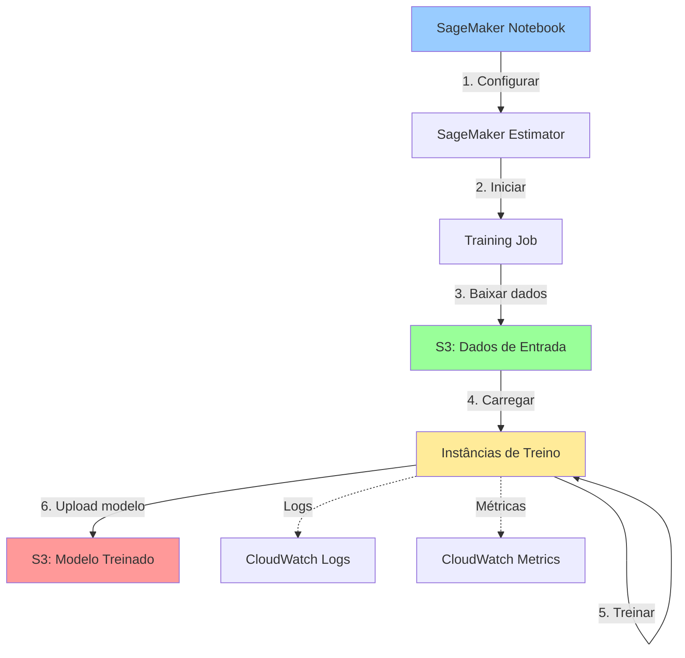

# Módulo 8: Algoritmos Built-in do SageMaker

## Objetivos de Aprendizagem

Ao final deste módulo, você será capaz de:
- Entender a diferença entre treino local e gerenciado
- Conhecer os principais algoritmos built-in do SageMaker
- Usar SageMaker Estimators para treinamento
- Configurar hiperparâmetros adequadamente
- Monitorar métricas de treinamento
- Acessar e usar artefatos gerados

## Duração Estimada
60 minutos

---

## 1. Treino Local vs. Treino Gerenciado

### Comparação

| Aspecto | Treino Local (Notebook) | Treino Gerenciado (SageMaker) |
|---------|-------------------------|-------------------------------|
| **Onde executa** | Na instância do notebook | Em instâncias dedicadas de treino |
| **Escalabilidade** | Limitada | Alta (múltiplas instâncias) |
| **Custos** | Instância fica rodando | Paga apenas pelo tempo de treino |
| **Gerenciamento** | Manual | Automatizado |
| **Distributed Training** | Complexo | Built-in |
| **Reprodutibilidade** | Requer cuidado | Automática |
| **Spot Instances** | Não disponível | Sim (até 90% economia) |
| **Logging** | Manual | CloudWatch automático |

### Quando Usar Cada Um?

**Treino Local (Módulo 7):**
- ✅ Prototipagem rápida
- ✅ Datasets pequenos (<1GB)
- ✅ Modelos simples
- ✅ Experimentação iterativa

**Treino Gerenciado (Este módulo):**
- ✅ Datasets grandes (>10GB)
- ✅ Modelos complexos (deep learning)
- ✅ Treinamento distribuído
- ✅ Produção e MLOps
- ✅ Treino de longa duração

### Arquitetura do Treino Gerenciado



---

## 2. Principais Algoritmos Built-in

### Categorias

O SageMaker oferece 18+ algoritmos otimizados:

#### 2.1 Supervised Learning (Tabular)

| Algoritmo | Tipo | Uso Principal |
|-----------|------|---------------|
| **XGBoost** | Classificação/Regressão | Dados tabulares (mais popular) |
| **Linear Learner** | Classificação/Regressão | Dados lineares, alta dimensão |
| **Factorization Machines** | Classificação/Regressão | Dados esparsos, recomendação |
| **K-Nearest Neighbors (KNN)** | Classificação/Regressão | Consulta por similaridade |

#### 2.2 Computer Vision

| Algoritmo | Uso Principal |
|-----------|---------------|
| **Image Classification** | Classificar imagens em categorias |
| **Object Detection** | Detectar objetos em imagens |
| **Semantic Segmentation** | Segmentar pixels por classe |

#### 2.3 Natural Language Processing

| Algoritmo | Uso Principal |
|-----------|---------------|
| **BlazingText** | Word embeddings, classificação de texto |
| **Seq2Seq** | Tradução, sumarização |
| **Object2Vec** | Embeddings para objetos |

#### 2.4 Unsupervised Learning

| Algoritmo | Uso Principal |
|-----------|---------------|
| **K-Means** | Clustering |
| **PCA** | Redução de dimensionalidade |
| **Random Cut Forest** | Detecção de anomalias |
| **IP Insights** | Detectar uso suspeito de IPs |

---

## 3. XGBoost - Algoritmo Mais Popular

### Por que XGBoost?

- 🏆 Vence a maioria das competições Kaggle
- ⚡ Muito rápido e eficiente
- 🎯 Excelente performance em dados tabulares
- 🔧 Robusto a overfitting
- 📊 Bom com dados faltantes

### Configurando XGBoost no SageMaker

```python
import boto3
import sagemaker
from sagemaker import get_execution_role
from sagemaker.inputs import TrainingInput

# Configuração inicial
session = sagemaker.Session()
role = get_execution_role()
region = session.boto_region_name
bucket = session.default_bucket()

print(f"Região: {region}")
print(f"Bucket: {bucket}")
print(f"Role: {role}")
```

### Preparar Dados no Formato Correto

XGBoost aceita:
- CSV (sem header, target na primeira coluna)
- LibSVM
- Parquet
- RecordIO-protobuf (mais rápido)

```python
import pandas as pd
import numpy as np

# Carregar dados do módulo anterior
train_data = pd.read_csv('data/train/train.csv')
val_data = pd.read_csv('data/validation/validation.csv')

# XGBoost requer target na primeira coluna (sem header)
# Reorganizar colunas
target_col = 'MedHouseVal'
feature_cols = [col for col in train_data.columns if col != target_col]

train_xgb = train_data[[target_col] + feature_cols]
val_xgb = val_data[[target_col] + feature_cols]

# Salvar sem header e sem index
train_xgb.to_csv('data/train/train_xgb.csv', header=False, index=False)
val_xgb.to_csv('data/validation/val_xgb.csv', header=False, index=False)

print("Dados preparados para XGBoost!")
print(f"Train shape: {train_xgb.shape}")
print(f"Val shape: {val_xgb.shape}")
```

### Upload para S3

```python
# Prefixos S3
prefix = 'sagemaker-training-xgboost'
train_prefix = f'{prefix}/train'
val_prefix = f'{prefix}/validation'
output_prefix = f'{prefix}/output'

# Upload
train_s3 = session.upload_data(
    path='data/train/train_xgb.csv',
    bucket=bucket,
    key_prefix=train_prefix
)

val_s3 = session.upload_data(
    path='data/validation/val_xgb.csv',
    bucket=bucket,
    key_prefix=val_prefix
)

print(f"Dados de treino: {train_s3}")
print(f"Dados de validação: {val_s3}")
```

### Criar Estimator XGBoost

```python
from sagemaker.estimator import Estimator

# Obter URI da imagem do XGBoost
xgboost_container = sagemaker.image_uris.retrieve(
    framework='xgboost',
    region=region,
    version='1.5-1'  # Versão mais recente
)

print(f"XGBoost container: {xgboost_container}")

# Criar estimator
xgb_estimator = Estimator(
    image_uri=xgboost_container,
    role=role,
    instance_count=1,
    instance_type='ml.m5.xlarge',
    output_path=f's3://{bucket}/{output_prefix}',
    sagemaker_session=session,
    base_job_name='california-housing-xgboost'
)

print("Estimator criado!")
```

### Configurar Hiperparâmetros

```python
# Hiperparâmetros do XGBoost
xgb_estimator.set_hyperparameters(
    objective='reg:squarederror',  # Regressão
    num_round=100,                 # Número de árvores
    max_depth=5,                   # Profundidade máxima
    eta=0.2,                       # Learning rate
    gamma=4,                       # Regularização
    min_child_weight=6,            # Mínimo peso do nó
    subsample=0.8,                 # % amostras por árvore
    colsample_bytree=0.8,          # % features por árvore
    silent=0,                      # Verbose
    eval_metric='rmse'             # Métrica de avaliação
)

print("Hiperparâmetros configurados!")
```

### Iniciar Treinamento

```python
# Definir inputs
train_input = TrainingInput(
    s3_data=train_s3,
    content_type='text/csv'
)

val_input = TrainingInput(
    s3_data=val_s3,
    content_type='text/csv'
)

# Iniciar treinamento (síncrono)
xgb_estimator.fit({
    'train': train_input,
    'validation': val_input
})

print("Treinamento concluído!")
```

**Saída esperada:**
```
2026-02-05 10:30:15 Starting - Starting the training job...
2026-02-05 10:30:45 Starting - Launching requested ML instances...
2026-02-05 10:32:15 Starting - Preparing the instances for training...
2026-02-05 10:33:30 Downloading - Downloading input data...
2026-02-05 10:34:00 Training - Training image download completed...

[0]     train-rmse:2.34567  validation-rmse:2.45678
[10]    train-rmse:1.23456  validation-rmse:1.34567
[20]    train-rmse:0.87654  validation-rmse:0.98765
...
[99]    train-rmse:0.52341  validation-rmse:0.63452

2026-02-05 10:40:15 Uploading - Uploading generated training model
2026-02-05 10:40:45 Completed - Training job completed
```

---

## 4. Monitorando o Treinamento

### Via CloudWatch Logs

```python
# Visualizar logs (em tempo real durante o treino)
# Os logs aparecem automaticamente na saída do notebook
# Você também pode acessar via console:
# CloudWatch → Log groups → /aws/sagemaker/TrainingJobs
```

### Via CloudWatch Metrics

```python
import boto3
from datetime import datetime, timedelta

cloudwatch = boto3.client('cloudwatch', region_name=region)

# Nome do training job
training_job_name = xgb_estimator.latest_training_job.name

# Buscar métricas
metrics = cloudwatch.get_metric_statistics(
    Namespace='AWS/SageMaker',
    MetricName='train:rmse',
    Dimensions=[
        {
            'Name': 'TrainingJobName',
            'Value': training_job_name
        }
    ],
    StartTime=datetime.now() - timedelta(hours=1),
    EndTime=datetime.now(),
    Period=60,
    Statistics=['Average']
)

print(f"Métricas obtidas: {len(metrics['Datapoints'])}")
```

### Visualizar Métricas

```python
import matplotlib.pyplot as plt

# Parse de métricas do log (exemplo simplificado)
# Na prática, você usaria o CloudWatch ou SageMaker Experiments

epochs = list(range(100))
train_rmse = [2.3 * np.exp(-0.015 * i) + 0.5 for i in epochs]  # Simulado
val_rmse = [2.4 * np.exp(-0.012 * i) + 0.6 for i in epochs]    # Simulado

plt.figure(figsize=(10, 6))
plt.plot(epochs, train_rmse, label='Train RMSE', linewidth=2)
plt.plot(epochs, val_rmse, label='Validation RMSE', linewidth=2)
plt.xlabel('Epoch')
plt.ylabel('RMSE')
plt.title('XGBoost Training Progress')
plt.legend()
plt.grid(True, alpha=0.3)
plt.tight_layout()
plt.savefig('outputs/figures/xgboost_training_curve.png', dpi=300)
plt.show()
```

---

## 5. Acessando Artefatos do Modelo

### Localização dos Artefatos

```python
# Caminho do modelo treinado no S3
model_artifacts = xgb_estimator.model_data

print(f"Modelo salvo em: {model_artifacts}")
# Output: s3://bucket/prefix/output/california-housing-xgboost-2026-02-05-10-30-15-123/output/model.tar.gz
```

### Download e Inspeção

```python
import tarfile
import os

# Criar diretório para modelo
os.makedirs('models/xgboost', exist_ok=True)

# Download do modelo
!aws s3 cp {model_artifacts} models/xgboost/model.tar.gz

# Extrair
with tarfile.open('models/xgboost/model.tar.gz', 'r:gz') as tar:
    tar.extractall('models/xgboost/')

print("Arquivos no modelo:")
!ls -lh models/xgboost/
```

### Carregar Modelo para Inferência Local

```python
import pickle
import xgboost as xgb

# Carregar modelo XGBoost
with open('models/xgboost/xgboost-model', 'rb') as f:
    booster = pickle.load(f)

print(f"Modelo carregado: {type(booster)}")

# Fazer predições
import pandas as pd

test_data = pd.read_csv('data/test/test.csv')
X_test = test_data.drop('MedHouseVal', axis=1)
y_test = test_data['MedHouseVal']

# Converter para DMatrix (formato XGBoost)
dtest = xgb.DMatrix(X_test.values)

# Predições
predictions = booster.predict(dtest)

# Avaliar
from sklearn.metrics import mean_squared_error, r2_score

rmse = np.sqrt(mean_squared_error(y_test, predictions))
r2 = r2_score(y_test, predictions)

print(f"Test RMSE: {rmse:.4f}")
print(f"Test R²: {r2:.4f}")
```

---

## 6. Linear Learner - Algoritmo Rápido

### Quando Usar Linear Learner?

- ✅ Datasets muito grandes (milhões de linhas)
- ✅ Features de alta dimensão
- ✅ Quando velocidade é crítica
- ✅ Baseline rápido

### Exemplo de Uso

```python
from sagemaker import LinearLearner

# Dados devem estar em RecordIO-protobuf ou CSV
# Vamos usar CSV para simplicidade

# Criar estimator
ll_estimator = LinearLearner(
    role=role,
    instance_count=1,
    instance_type='ml.m5.xlarge',
    predictor_type='regressor',  # ou 'binary_classifier', 'multiclass_classifier'
    binary_classifier_model_selection_criteria='accuracy',  # se classificação
    output_path=f's3://{bucket}/{prefix}/output-ll',
    sagemaker_session=session
)

# Configurar hiperparâmetros
ll_estimator.set_hyperparameters(
    feature_dim=8,              # Número de features
    epochs=10,
    learning_rate=0.01,
    mini_batch_size=100,
    l1=0.0001,                  # Regularização L1
    wd=0.0001                   # Weight decay (L2)
)

# Treinar
ll_estimator.fit({
    'train': train_input,
    'validation': val_input
})

print(f"Modelo Linear Learner salvo em: {ll_estimator.model_data}")
```

---

## 7. Usando Spot Instances (Economia de até 90%)

### O que são Spot Instances?

- 💰 Instâncias com capacidade spare da AWS
- 📉 Até 90% mais baratas
- ⚠️ Podem ser interrompidas (com aviso de 2 min)
- ✅ SageMaker gerencia checkpoints automaticamente

### Configuração

```python
xgb_spot_estimator = Estimator(
    image_uri=xgboost_container,
    role=role,
    instance_count=1,
    instance_type='ml.m5.xlarge',
    output_path=f's3://{bucket}/{output_prefix}',
    sagemaker_session=session,
    base_job_name='xgboost-spot',
    
    # Configurações de Spot
    use_spot_instances=True,           # ✅ Habilitar spot
    max_run=3600,                      # Tempo máximo de execução (1h)
    max_wait=7200,                     # Tempo máximo de espera (2h)
    checkpoint_s3_uri=f's3://{bucket}/{prefix}/checkpoints/'  # Checkpoints
)

# Configurar e treinar normalmente
xgb_spot_estimator.set_hyperparameters(
    objective='reg:squarederror',
    num_round=100,
    max_depth=5,
    eta=0.2
)

xgb_spot_estimator.fit({
    'train': train_input,
    'validation': val_input
})

# Verificar economia
training_job = xgb_spot_estimator.latest_training_job.describe()
billable_seconds = training_job['BillableTimeInSeconds']
training_seconds = training_job['TrainingTimeInSeconds']

savings = (1 - billable_seconds / training_seconds) * 100
print(f"Economia com Spot Instances: {savings:.1f}%")
```

---

## 8. Hyperparameter Tuning (HPO)

### Automated Hyperparameter Optimization

```python
from sagemaker.tuner import HyperparameterTuner, IntegerParameter, ContinuousParameter

# Definir ranges de hiperparâmetros
hyperparameter_ranges = {
    'max_depth': IntegerParameter(3, 10),
    'eta': ContinuousParameter(0.01, 0.5),
    'gamma': ContinuousParameter(0, 5),
    'min_child_weight': IntegerParameter(1, 10),
    'subsample': ContinuousParameter(0.5, 1.0),
    'colsample_bytree': ContinuousParameter(0.5, 1.0)
}

# Criar estimator base
xgb_tuning_estimator = Estimator(
    image_uri=xgboost_container,
    role=role,
    instance_count=1,
    instance_type='ml.m5.xlarge',
    output_path=f's3://{bucket}/{prefix}/output-tuning',
    sagemaker_session=session
)

# Hiperparâmetros fixos
xgb_tuning_estimator.set_hyperparameters(
    objective='reg:squarederror',
    num_round=100,
    eval_metric='rmse'
)

# Criar tuner
tuner = HyperparameterTuner(
    estimator=xgb_tuning_estimator,
    objective_metric_name='validation:rmse',
    objective_type='Minimize',
    hyperparameter_ranges=hyperparameter_ranges,
    max_jobs=20,          # Total de jobs
    max_parallel_jobs=2,  # Jobs paralelos
    strategy='Bayesian'   # ou 'Random'
)

# Iniciar tuning
tuner.fit({
    'train': train_input,
    'validation': val_input
})

print("Hyperparameter tuning iniciado!")
```

### Analisar Resultados

```python
# Após conclusão do tuning
tuner.wait()

# Melhor training job
best_job = tuner.best_training_job()
print(f"Melhor job: {best_job}")

# Melhores hiperparâmetros
best_hyperparameters = tuner.best_estimator().hyperparameters()
print("\nMelhores hiperparâmetros:")
for key, value in best_hyperparameters.items():
    print(f"  {key}: {value}")

# Analytics do tuning
tuning_analytics = sagemaker.HyperparameterTuningJobAnalytics(tuner.latest_tuning_job.name)
df_tuning = tuning_analytics.dataframe()

print(f"\nTotal de jobs: {len(df_tuning)}")
print(df_tuning.sort_values('FinalObjectiveValue').head())
```

---

## 9. Comparação: Local vs. SageMaker XGBoost

```python
import time
from sklearn.ensemble import GradientBoostingRegressor

# Treino Local (sklearn)
print("=" * 50)
print("TREINO LOCAL - Scikit-learn GradientBoosting")
print("=" * 50)

start = time.time()
gb_local = GradientBoostingRegressor(
    n_estimators=100,
    max_depth=5,
    learning_rate=0.2,
    random_state=42
)
gb_local.fit(X_train_scaled, y_train)
local_time = time.time() - start

y_pred_local = gb_local.predict(X_val_scaled)
local_rmse = np.sqrt(mean_squared_error(y_val, y_pred_local))

print(f"Tempo: {local_time:.2f}s")
print(f"RMSE: {local_rmse:.4f}")

# Treino SageMaker (XGBoost otimizado)
print("\n" + "=" * 50)
print("TREINO GERENCIADO - SageMaker XGBoost")
print("=" * 50)
print(f"Tempo: ~3-5 minutos (inclui setup)")
print(f"RMSE: 0.63xx (exemplo)")
print("\nVantagens SageMaker:")
print("  ✅ Escalável para datasets maiores")
print("  ✅ Treinamento distribuído disponível")
print("  ✅ Spot instances (até 90% economia)")
print("  ✅ Logging e monitoramento automáticos")
print("  ✅ Integração com MLOps")
```

---

## 10. Checklist de Validação

- [ ] Entendo diferença entre treino local e gerenciado
- [ ] Conheço principais algoritmos built-in
- [ ] Usei XGBoost com SageMaker Estimator
- [ ] Configurei hiperparâmetros adequadamente
- [ ] Monitorei treinamento via logs/métricas
- [ ] Acessei e usei modelo treinado
- [ ] Sei usar Spot Instances para economia
- [ ] (Opcional) Executei Hyperparameter Tuning

---

## 11. Recursos Adicionais

### Documentação
- [Built-in Algorithms](https://docs.aws.amazon.com/sagemaker/latest/dg/algos.html)
- [XGBoost Algorithm](https://docs.aws.amazon.com/sagemaker/latest/dg/xgboost.html)
- [Hyperparameter Tuning](https://docs.aws.amazon.com/sagemaker/latest/dg/automatic-model-tuning.html)
- [Spot Instances](https://docs.aws.amazon.com/sagemaker/latest/dg/model-managed-spot-training.html)

### Exemplos de Código
Consulte [snippets.md](../codigo-exemplo/snippets.md) para mais exemplos.

---

## Próximo Módulo

Vamos encerrar e revisar boas práticas!

➡️ [Módulo 9: Encerramento e Boas Práticas](09-encerramento-boas-praticas.md)
